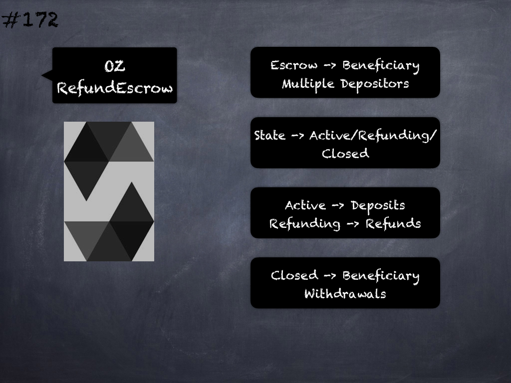

# 171 - [OZ ConditionalEscrow](OZ%20ConditionalEscrow.md)
OpenZeppelin ConditionalEscrow: Derived from Escrow and only allows withdrawal if a condition is met by providing the `withdrawalAllowed()` function which returns whether an address is allowed to withdraw their funds and is to be implemented by derived contracts.

___
## Slide Screenshot

___
## Slide Text
- Escrow Funds for Payee
- Conditional Withdrawal
- `withdrawalAllowed()` -> Check Condition
- `withdraw(payee)`
	- `public` vs `onlyOwner`
- `require(withdrawalAllowed(payee))` -> withdraw
___
## References
- [Youtube Reference](https://youtu.be/L_9Fk6HRwpU?t=707)
___
## Tags