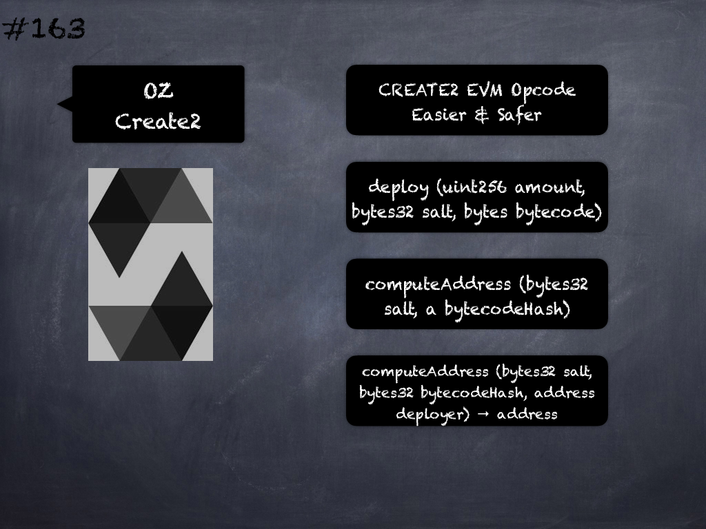

# 161 - [OZ Context](OZ%20Context.md)
OpenZeppelin Context: Provides information about the current execution context, including the sender of the transaction and its data. 

While these are generally available via _msg.sender_ and _msg.data_, they should not be accessed in such a direct manner, since when dealing with meta-transactions the account sending and paying for execution may not be the actual sender (as far as an application is concerned). 

This contract is only required for intermediate, library-like contracts.
___
## Slide Screenshot

___
## Slide Deck
- Current Execution Context
- [FIXME]
___
## References
- Youtube Reference
___
## Tags