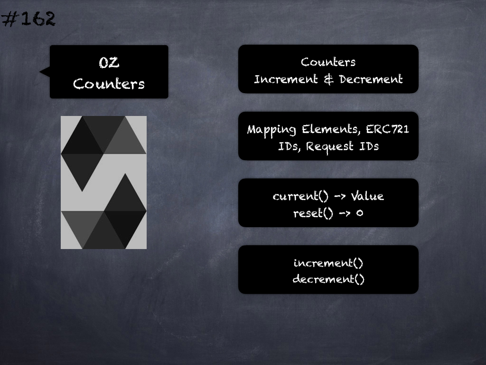

# 162 - [OZ Counters](OZ%20Counters.md)
OpenZeppelin Counters: Provides counters that can only be incremented or decremented by one. 

This can be used e.g. to track the number of elements in a mapping, issuing ERC721 ids, or counting request ids. Functions are:

1.  current(struct Counters.Counter counter) → uint256
    
2.  increment(struct Counters.Counter counter)
    
3.  decrement(struct Counters.Counter counter)
___
## Slide Screenshot

___
## Slide Deck

___
## References
- Youtube Reference
___
## Tags