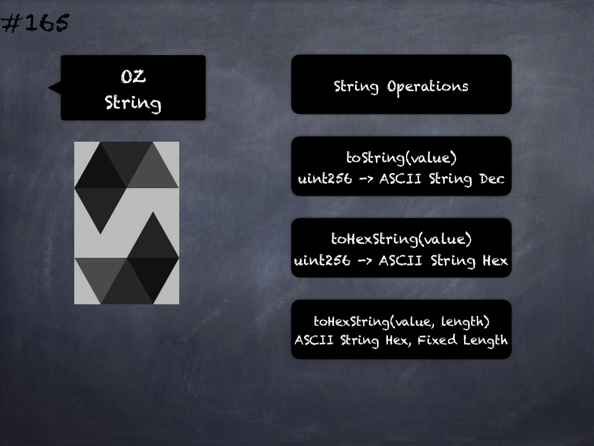

# 163 - [OZ Create2](OZ%20Create2.md)
OpenZeppelin Create2: makes usage of the CREATE2 EVM opcode easier and safer. 

CREATE2 can be used to compute in advance the address where a smart contract will be deployed, which allows for interesting new mechanisms known as 'counterfactual interactions’. 

1.  _deploy(uint256 amount, bytes32 salt, bytes bytecode)_ → _address_: Deploys a contract using CREATE2. The address where the contract will be deployed can be known in advance via computeAddress.The bytecode for a contract can be obtained from Solidity with type(contractName).creationCode. Requirements: 1) bytecode must not be empty. 2) salt must have not been used for bytecode already. 3) the factory must have a balance of at least amount. 4) if amount is non-zero, bytecode must have a payable constructor.
    
2.  _computeAddress(bytes32 salt, bytes32 bytecodeHash)_ → _address_: Returns the address where a contract will be stored if deployed via deploy. Any change in the bytecodeHash or salt will result in a new destination address.
    
3.  _computeAddress(bytes32 salt, bytes32 bytecodeHash, address deployer)_ → _address_: Returns the address where a contract will be stored if deployed via deploy from a contract located at deployer. If the deployer is this contract’s address, it returns the same value as computeAddress.

___
## Slide Screenshot

___
## Slide Deck

___
## References
- Youtube Reference
___
## Tags