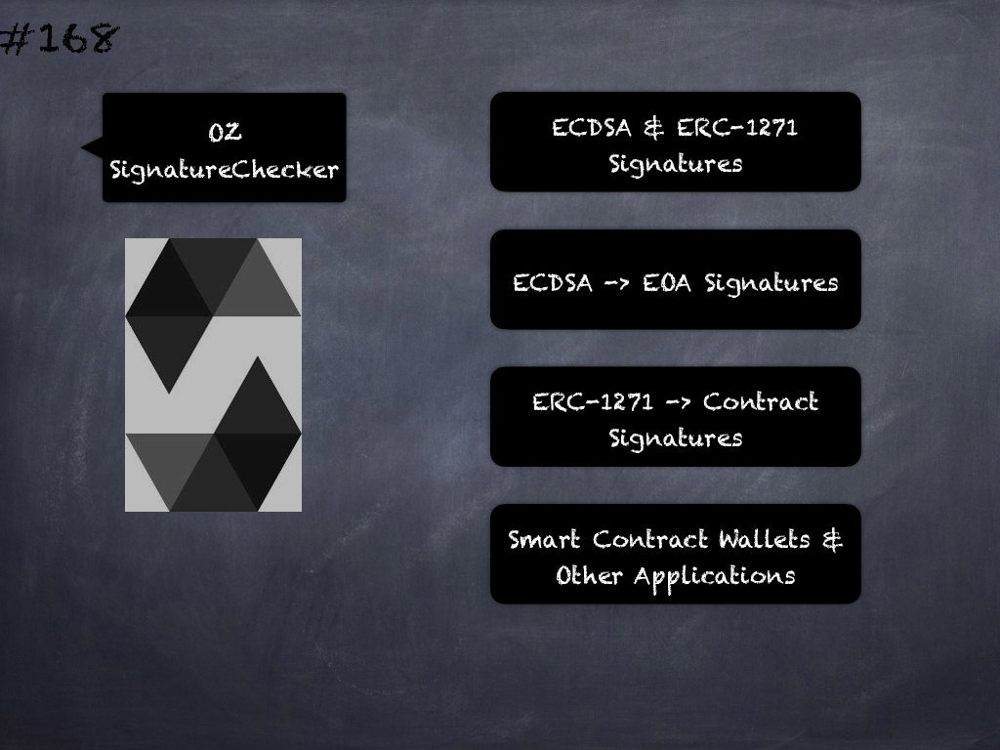

# 166 - [OZ ECDSA](OZ%20ECDSA.md)
OpenZeppelin ECDSA: provides functions for recovering and managing Ethereum account ECDSA signatures. 

These are often generated via `web3.eth.sign`, and are a 65 byte array (of type bytes in Solidity) arranged the following way: `[[v (1)], [r (32)], [s (32)]]`. 

The data signer can be recovered with `ECDSA.recover`, and its address compared to verify the signature.

Most wallets will hash the data to sign and add the prefix `\x19Ethereum Signed Message:\n`, so when attempting to recover the signer of an Ethereum signed message hash, you’ll want to use `toEthSignedMessageHash`.

The `ecrecover` EVM opcode allows for malleable (non-unique) signatures. 

This library prevents that by requiring the `s` value to be in the lower half order, and the `v` value to be either 27 or 28.

___
## Slide Screenshot

___
## Slide Deck
- ECDSA Signatures
- Signature -> (v, r, s)
- v=1B, r=32B, s=32B
- `recover(msgHash, signature)` -> `signerAddress`
- EVM ecrecover -> Malleable
- OZ ECDSA -> v=27/28, s=lower
___
## References
- [Youtube Reference](https://youtu.be/L_9Fk6HRwpU?t=343)
___
## Tags