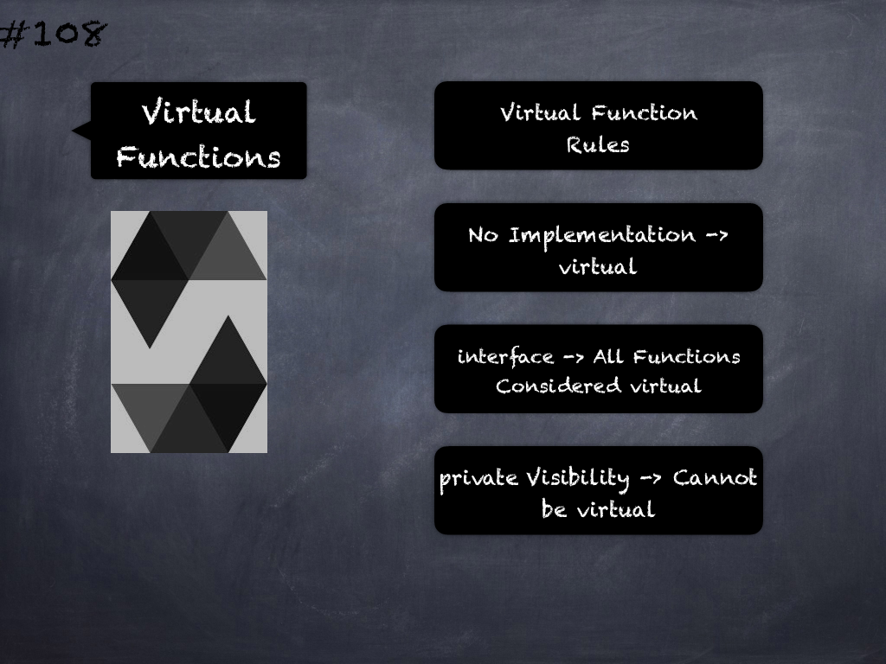

# 169 - [OZ EIP-712](OZ%20EIP-712.md)
OpenZeppelin EIP712: EIP 712 is a standard for hashing and signing of typed structured data. This contract implements the EIP 712 domain separator (`_domainSeparatorV4`) that is used as part of the encoding scheme, and the final step of the encoding to obtain the message digest that is then signed via ECDSA (`_hashTypedDataV4`). Protocols need to implement the type-specific encoding they need in their contracts using a combination of abi.encode and keccak256.

1.  `constructor(string name, string version)`: Initializes the domain separator and parameter caches. The meaning of name and version is specified in EIP 712: 
	1.  `name` is the user readable name of the signing domain, i.e. the name of the DApp or the protocol
	2.  `version`: the current major version of the signing domain.
    
2.  `_domainSeparatorV4()` → `bytes32`: Returns the domain separator for the current chain.
    
    1.  `_hashTypedDataV4(bytes32 structHash)` → `bytes32`: Given an already hashed struct, this function returns the hash of the fully encoded EIP712 message for this domain. This hash can be used together with ECDSA.recover to obtain the signer of a message.

___
## Slide Screenshot

___
## Slide Text
- Hashing & Signing Typed Structured Data
- EIP-712 Domain Separator
- block.chainID & address(this)
- Security: Prevent Replay Attacks
___
## References
- [Youtube Reference](https://youtu.be/L_9Fk6HRwpU?t=595)
___
## Tags