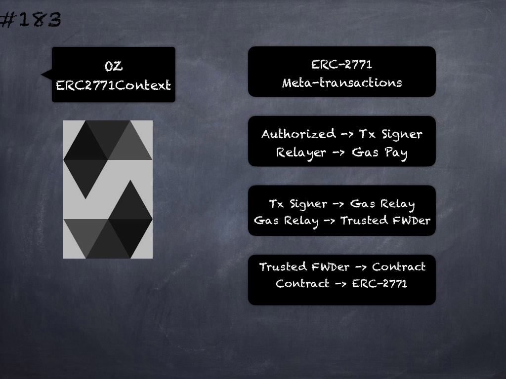

# 183 - [OZ ERC2771Context](OZ%20ERC2771Context.md)
OpenZeppelin ERC2771Context: A Context variant for ERC2771. ERC2771 provides support for meta transactions, which are transactions that have been:

1.  Authorized by the Transaction Signer. For example, signed by an externally owned account
    
2.  Relayed by an untrusted third party that pays for the gas (the Gas Relay)

The problem is that for a contract that is not natively aware of meta transactions, the _msg.sender_ of the transaction will make it appear to be coming from the Gas Relay and not the Transaction Signer. 

A secure protocol for a contract to accept meta transactions needs to prevent the Gas Relay from forging, modifying or duplicating requests by the Transaction Signer. 

The entities are:

1.  Transaction Signer - entity that signs & sends to request to Gas Relay
    
2.  Gas Relay - receives a signed request off-chain from Transaction Signer and pays gas to turn it into a valid transaction that goes through Trusted Forwarder
    
3.  Trusted Forwarder - a contract that is trusted by the Recipient to correctly verify the signature and nonce before forwarding the request from Transaction Signer
    
4.  Recipient - a contract that can securely accept meta-transactions through a Trusted Forwarder by being compliant with this standard.
___
## Slide Screenshot

___
## Slide Deck

___
## References
- Youtube Reference
___
## Tags