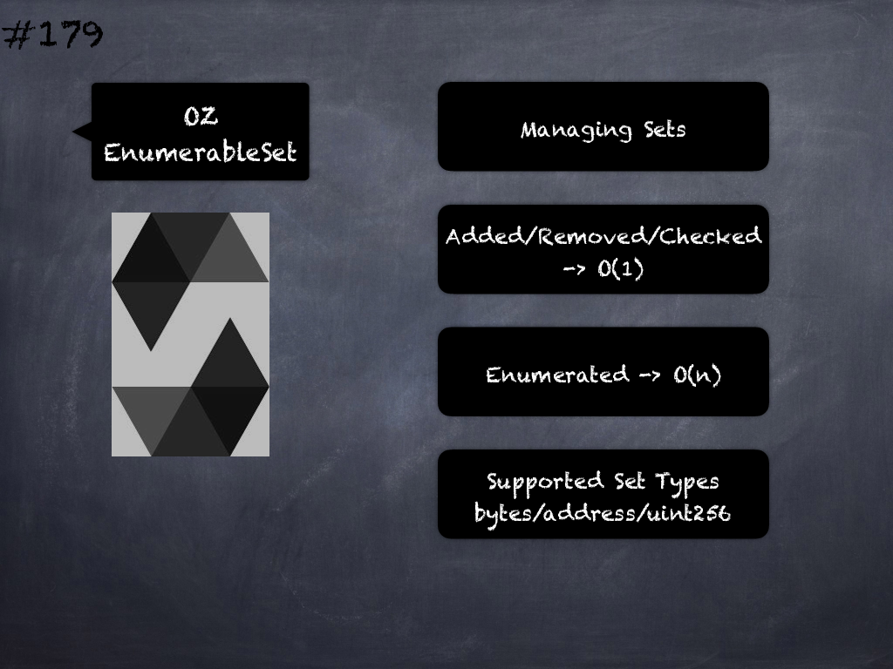

# 179 - [OZ EnumerableSet](OZ%20EnumerableSet.md)
OpenZeppelin EnumerableSet: Library for managing sets of primitive types. Sets have the following properties: 
1. Elements are added, removed, and checked for existence in constant time (`O(1)`) 
2. Elements are enumerated in `O(n)`. No guarantees are made on the ordering. As of v3.3.0, sets of type `bytes32` (`Bytes32Set`), `address` (`AddressSet`) and `uint256` (`UintSet`) are supported.

1.  `add(struct EnumerableSet.Bytes32Set set, bytes32 value)` → `bool`: Add a value to a set. Returns `true` if the value was added to the set, that is if it was not already present.
    
2.  `remove(struct EnumerableSet.Bytes32Set set, bytes32 value)` → `bool`: Removes a value from a set. Returns `true` if the value was removed from the set, that is if it was present.
    
3.  `contains(struct EnumerableSet.Bytes32Set set, bytes32 value)` → `bool`: Returns `true` if the value is in the set.
    
4.  `length(struct EnumerableSet.Bytes32Set set)` → `uint256`: Returns the number of values in the set.
    
5.  `at(struct EnumerableSet.Bytes32Set set, uint256 index)` → `bytes32`: Returns the value stored at position index in the set. Note that there are no guarantees on the ordering of values inside the array, and it may change when more values are added or removed. Requirements: index must be strictly less than length.
    
6.  `add(struct EnumerableSet.AddressSet set, address value)` → `bool`: Add a value to a set. Returns true if the value was added to the set, that is if it was not already present.
    
7.  `remove(struct EnumerableSet.AddressSet set, address value)` → `bool`: Removes a value from a set. Returns true if the value was removed from the set, that is if it was present.
    
8.  `contains(struct EnumerableSet.AddressSet set, address value)` → `bool`: Returns true if the value is in the set. length(struct EnumerableSet.AddressSet set) → uint256: Returns the number of values in the set.
    
9.  `at(struct EnumerableSet.AddressSet set, uint256 index)` → `address`: Returns the value stored at position index in the set. Note that there are no guarantees on the ordering of values inside the array, and it may change when more values are added or removed. Requirements: index must be strictly less than length.
    
10.  `add(struct EnumerableSet.UintSet set, uint256 value)` → `bool`: Add a value to a set. Returns true if the value was added to the set, that is if it was not already present.
    
11.  `remove(struct EnumerableSet.UintSet set, uint256 value)` → `bool`: Removes a value from a set. Returns true if the value was removed from the set, that is if it was present.
    
12.  `contains(struct EnumerableSet.UintSet set, uint256 value)` → `bool`: Returns true if the value is in the set. O(1).
    
13.  `length(struct EnumerableSet.UintSet set)` → `uint256`: Returns the number of values on the set.
    
14.  `at(struct EnumerableSet.UintSet set, uint256 index)` → `uint256`: Returns the value stored at position index in the set. Note that there are no guarantees on the ordering of values inside the array, and it may change when more values are added or removed. Requirements: index must be strictly less than length.

___
## Slide Screenshot

___
## Slide Text
- Managing Sets
- Added/Removed/Checked -> o(1)
- Enumerated -> o(n)
- Supported Set Types -> bytes/address/uint256
___
## References
- [Youtube Reference](https://youtu.be/L_9Fk6HRwpU?t=1123)
___
## Tags