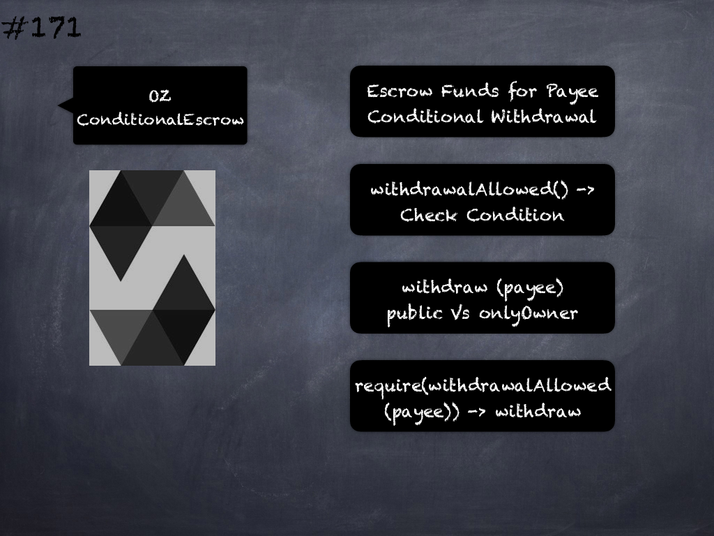

# 170 - [OZ Escrow](OZ%20Escrow.md)
OpenZeppelin Escrow: holds funds designated for a payee until they withdraw them. The contract that uses this escrow as its payment method should be its owner, and provide public methods redirecting to the escrow's deposit and withdraw if the escrow rules are satisfied.

1.  _depositsOf(address payee)_ → _uint256_: 
    
2.  _deposit(address payee)_: Stores the sent amount as credit to be withdrawn.
    
3.  _withdraw(address payable payee)_: Withdraw accumulated balance for a payee, forwarding all gas to the recipient.

___
## Slide Screenshot

___
## Slide Deck

___
## References
- Youtube Reference
___
## Tags