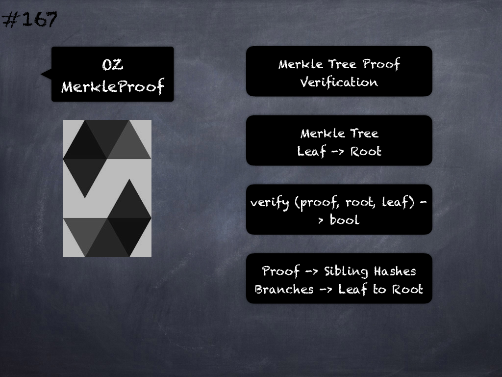

# 167 - [OZ MerkleProof](OZ%20MerkleProof.md)
OpenZeppelin MerkleProof: This deals with verification of Merkle Trees proofs.

1.  _verify:_ which can prove that some value is part of a Merkle tree. Returns true if a `leaf` can be proved to be a part of a Merkle tree defined by `root`. For this, a `proof` must be provided, containing sibling hashes on the branch from the leaf to the root of the tree. Each pair of leaves and each pair of pre-images are assumed to be sorted.

___
## Slide Screenshot

___
## Slide Deck

___
## References
- Youtube Reference
___
## Tags