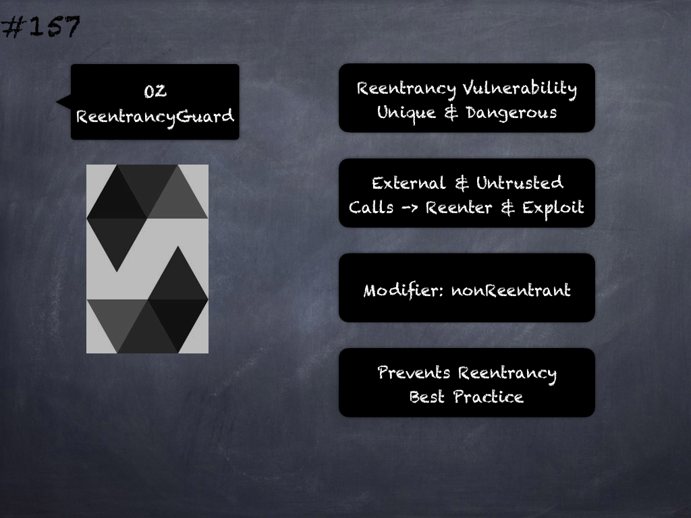

# 154 - [OZ Ownable](OZ%20Ownable.md)
OpenZeppelin Ownable: provides a basic access control mechanism, where there is an account (an owner) that can be granted exclusive access to specific functions. 

By default, the owner account will be the one that deploys the contract. This can later be changed with _transferOwnership_. 

This module is used through inheritance. 

It will make available the modifier _onlyOwner_, which can be applied to your functions to restrict their use to the owner.

___
## Slide Screenshot

___
## Slide Deck
- Basic Access Control
	- Contract -> Owner
- Default Owner -> Contract Deployer
- Exclusive Owner Access -> Special Functions
- Modifier `onlyOwner`
- `transferOwnership()`
___
## References
- [Youtube Reference](https://youtu.be/C0zBhTgppLQ?t=1642)
___
## Tags