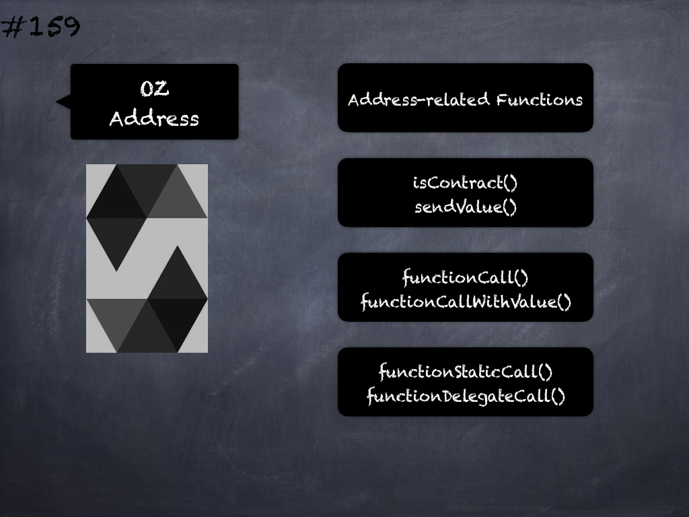

# 156 - [OZ Pausable](OZ%20Pausable.md)
OpenZeppelin Pausable: provides an emergency stop mechanism using functions pause and unpause that can be triggered by an authorized account. 

This module is used through inheritance. 

It will make available the modifiers _whenNotPaused_ and _whenPaused_, which can be applied to the functions of your contract. 

Only the functions using the modifiers will be affected when the contract is paused or unpaused.
___
## Slide Screenshot

___
## Slide Deck
- Guarded Launch
	- Emergency -> Remediate
- `pause()` & `unpause()`
	- Authorized Access
- Modifiers: `whenPaused` & `whenNotPaused`
- Vulnerability or Exploit Circuit-breaker
___
## References
- [Youtube Reference](https://youtu.be/C0zBhTgppLQ?t=1775)
___
## Tags