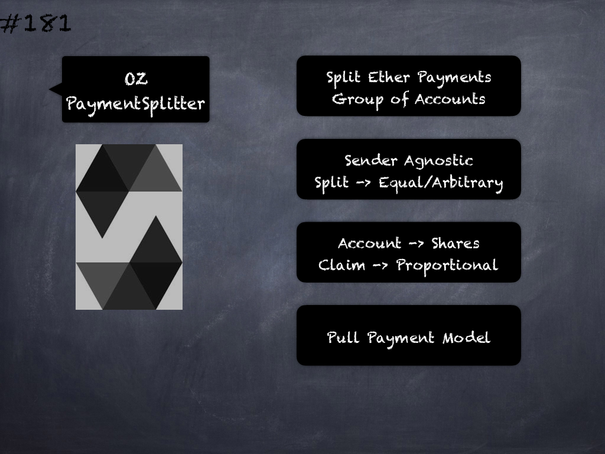

# 181 - [OZ PaymentSplitter](OZ%20PaymentSplitter.md)
OpenZeppelin PaymentSplitter: allows to split Ether payments among a group of accounts. The sender does not need to be aware that the Ether will be split in this way, since it is handled transparently by the contract. The split can be in equal parts or in any other arbitrary proportion. The way this is specified is by assigning each account to a number of shares. Of all the Ether that this contract receives, each account will then be able to claim an amount proportional to the percentage of total shares they were assigned.

PaymentSplitter follows a pull payment model. This means that payments are not automatically forwarded to the accounts but kept in this contract, and the actual transfer is triggered as a separate step by calling the release function.
___
## Slide Screenshot

___
## Slide Deck

___
## References
- Youtube Reference
___
## Tags