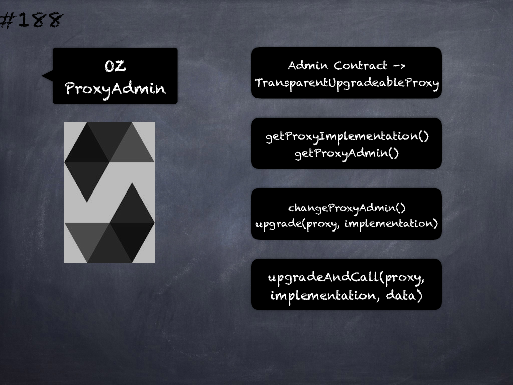

# 188 - [OZ ProxyAdmin](OZ%20ProxyAdmin.md)
OpenZeppelin ProxyAdmin: This is an auxiliary contract meant to be assigned as the admin of a TransparentUpgradeableProxy. 

1.  `getProxyImplementation(contract TransparentUpgradeableProxy proxy)` → `address`: Returns the current implementation of proxy. Requirements: This contract must be the admin of proxy.
    
2.  `getProxyAdmin(contract TransparentUpgradeableProxy proxy)` → `address`: Returns the current admin of proxy. Requirements: This contract must be the admin of proxy.
    
3.  `changeProxyAdmin(contract TransparentUpgradeableProxy proxy, address newAdmin)`: Changes the admin of proxy to newAdmin. Requirements: This contract must be the current admin of proxy.
    
4.  `upgrade(contract TransparentUpgradeableProxy proxy, address implementation)`: Upgrades proxy to implementation. Requirements: This contract must be the admin of proxy.
    
5.  `upgradeAndCall(contract TransparentUpgradeableProxy proxy, address implementation, bytes data)`: Upgrades proxy to implementation and calls a function on the new implementation. Requirements: This contract must be the admin of proxy.
___
## Slide Screenshot

___
## Slide Deck
- Admin Contract -> TransparentUpgradeableProxy
- `getProxyImplementation()`
- `getProxyAdmin()`
- `changeProxyAdmin()`
- `upgrade(proxy, implementation)`
- `upgradeAndCall(proxy, implementation, data)`
___
## References
- [Youtube Reference](https://youtu.be/0kx8M4u5980?t=702)
___
## Tags