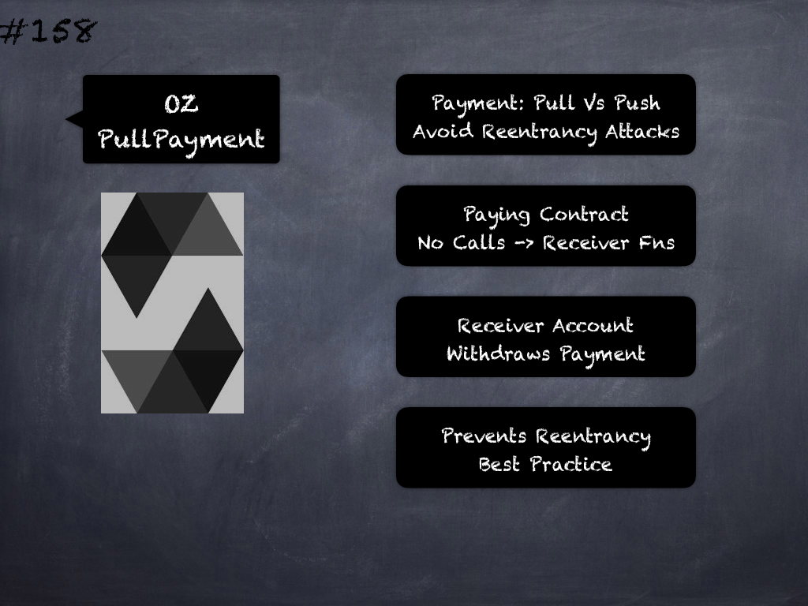

# 158 - [OZ PullPayment](OZ%20PullPayment.md)
OpenZeppelin PullPayment: provides a pull-payment strategy, where the paying contract doesn’t invoke any functions on the receiver account which must withdraw its payments itself. 

Pull-payments are often considered the best practice when it comes to sending Ether, security-wise. 

It prevents recipients from blocking execution and eliminates reentrancy concerns.
___
## Slide Screenshot

___
## Slide Text
- Payment: Pull Vs. Push
- Avoid Reentrancy Attacks
- Paying Contract
- No Calls -> Receiver Fns
- Receiver Account
- Withdraws Payment
- Prevents Reentrancy
	- Best Practice
___
## References
- [Youtube Reference](https://youtu.be/C0zBhTgppLQ?t=2093)
___
## Tags