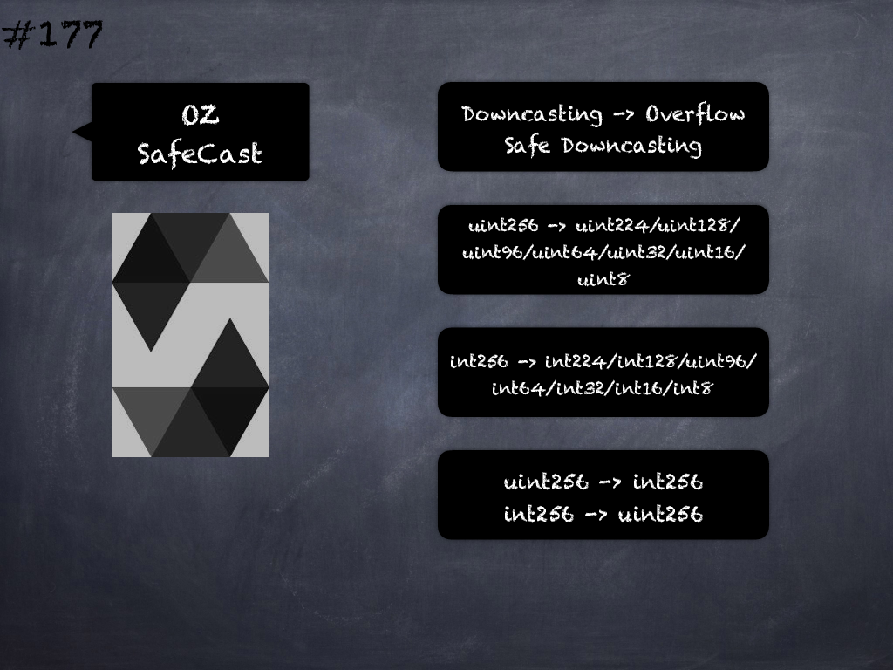

# 177 - [OZ SafeCase](OZ%20SafeCase.md)
OpenZeppelin SafeCast: Wrappers over Solidity's uintXX/intXX casting operators with added overflow checks. Downcasting from uint256/int256 in Solidity does not revert on overflow. This can easily result in undesired exploitation or bugs, since developers usually assume that overflows raise errors. `SafeCast` restores this intuition by reverting the transaction when such an operation overflows.

1.  _toUint128(uint256 value) returns (uint128)_: Returns the downcasted uint128 from uint256, reverting on overflow (when the input is greater than largest uint128). Similar functions are available for toUint64(uint256 value), toUint32(uint256 value), toUint16(uint256 value), toUint8(uint256 value)
    
2.  _toInt128(int256 value) internal pure returns (uint256)_: Returns the downcasted int128 from int256, reverting on overflow (when the input is less than smallest int128 or greater than largest int128). Similar functions are available for toInt64(int256 value), toInt32(int256 value), toInt16(int256 value), toInt8(int256 value).
    
3.  _function toInt256(uint256 value) returns (int256)_: Converts an unsigned uint256 into a signed int256
    
4.  _function toUint256(int256 value)_ returns (uint256): Converts a signed int256 into an unsigned uint256
    
5.  Similar functions downcasting to 224/96/64/32/16/8 bits for both unsigned and signed.
___
## Slide Screenshot

___
## Slide Deck

___
## References
- Youtube Reference
___
## Tags