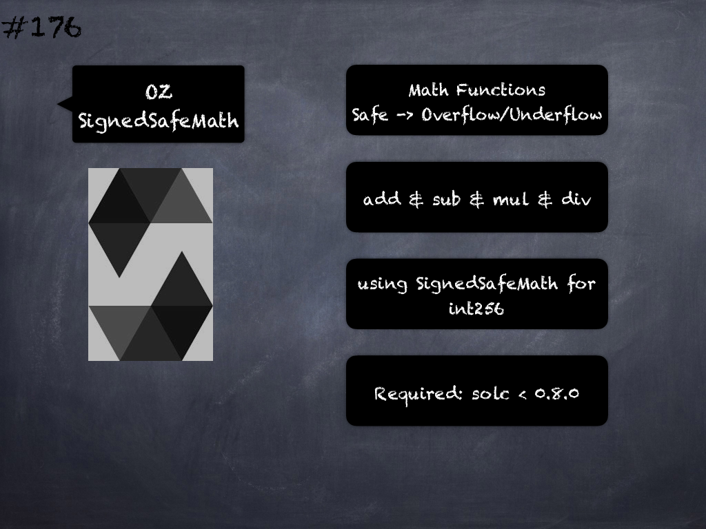

# 175 - [OZ SafeMath](OZ%20SafeMath.md)
OpenZeppelin SafeMath: provides mathematical functions that protect your contract from overflows and underflows. Include the contract with using SafeMath for uint256; and then call the functions:

1.  `myNumber.add(otherNumber)`: Returns the addition of two unsigned integers, reverting on overflow. Counterpart to Solidity's `+` operator.
    
2.  `myNumber.sub(otherNumber)`: Returns the subtraction of two unsigned integers, reverting on overflow (when the result is negative). Counterpart to Solidity's `-` operator.
    
3.  `myNumber.div(otherNumber)`: Returns the division of two unsigned integers, reverting on overflow. The result is rounded towards zero. Counterpart to Solidity's `/` operator.
    
4.  `myNumber.mul(otherNumber)`: Returns the multiplication of two unsigned integers, reverting on overflow. Counterpart to Solidity's `*` operator.
    
5.  `myNumber.mod(otherNumber)`: Returns the modulus of two unsigned integers, reverting when dividing by zero. Counterpart to Solidity's `%` operator.

The corresponding `try*` functions return results with an overflow flag instead of reverting.
___
## Slide Screenshot

___
## Slide Text
- Math Functions
- Safe -> Overflow/Underflow
- add & sub & mul & div & mod
- using SafeMath for uint256
- try* -> Flag vs Revert
- Required: solc `<` 0.8.0
___
## References
- [Youtube Reference](https://youtu.be/L_9Fk6HRwpU?t=857)
___
## Tags