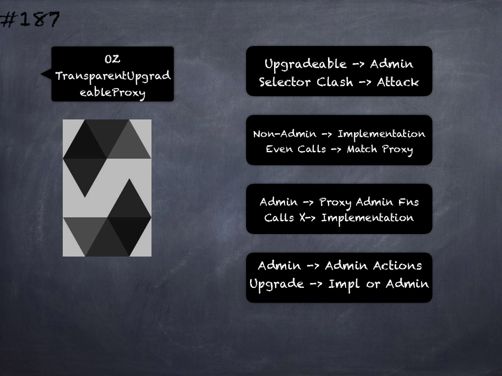

# 187 - [OZ TransparentUpgradeableProxy](OZ%20TransparentUpgradeableProxy.md)
OpenZeppelin TransparentUpgradeableProxy: implements a proxy that is upgradeable by an admin. 

To avoid proxy selector clashing, which can potentially be used in an attack, this contract uses the transparent proxy pattern. 

This pattern implies two things that go hand in hand: 

1. If any account other than the admin calls the proxy, the call will be forwarded to the implementation, even if that call matches one of the admin functions exposed by the proxy itself
2. If the admin calls the proxy, it can access the admin functions, but its calls will never be forwarded to the implementation. 

If the admin tries to call a function on the implementation it will fail with an error that says "admin cannot fallback to proxy target”.

These properties mean that the admin account can only be used for admin actions like upgrading the proxy or changing the admin, so it’s best if it’s a dedicated account that is not used for anything else. 

This will avoid headaches due to sudden errors when trying to call a function from the proxy implementation.

1.  _constructor(address _logic, address admin_, bytes _data)_: Initializes an upgradeable proxy managed by _admin, backed by the implementation at _logic, and optionally initialized with _data.
    
2.  _admin()_ → _address admin__: Returns the current admin.
    
3.  _implementation()_ → _address implementation__: Returns the current implementation.
    
4.  _changeAdmin(address newAdmin)_: Changes the admin of the proxy. Emits an AdminChanged event.
    
5.  _upgradeTo(address newImplementation)_: Upgrade the implementation of the proxy.
    
6.  _upgradeToAndCall(address newImplementation, bytes data)_: Upgrade the implementation of the proxy, and then call a function from the new implementation as specified by data, which should be an encoded function call. This is useful to initialize new storage variables in the proxied contract.
    
7.  __admin()_ → _address adm_: Returns the current admin.
    
8.  __beforeFallback()_: Makes sure the admin cannot access the fallback function.
___
## Slide Screenshot

___
## Slide Deck

___
## References
- Youtube Reference
___
## Tags