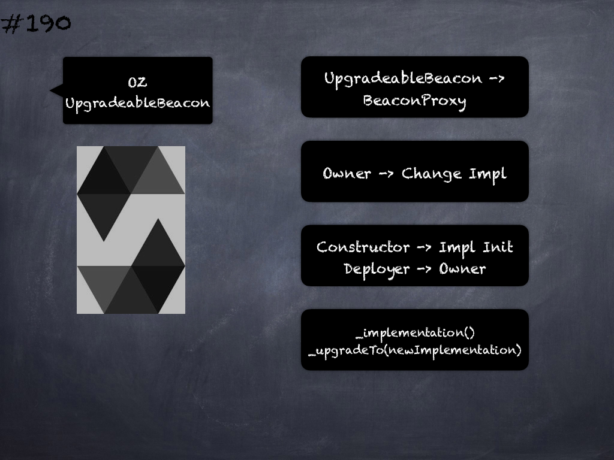

# 190 - [OZ UpgradeableBeacon](OZ%20UpgradeableBeacon.md)
OpenZeppelin UpgradeableBeacon: is used in conjunction with one or more instances of BeaconProxy to determine their implementation contract, which is where they will delegate all function calls. 

An owner is able to change the implementation the beacon points to, thus upgrading the proxies that use this beacon.

1.  `constructor(address implementation`)`: Sets the address of the initial implementation, and the deployer account as the owner who can upgrade the beacon.
    
2.  `implementation()` → `address`: Returns the current implementation address.
    
3.  `upgradeTo(address newImplementation)`: Upgrades the beacon to a new implementation. Emits an Upgraded event. Requirements: 
  
  1. `msg.sender` must be the owner of the contract
  
  2. `newImplementation` must be a contract.

___
## Slide Screenshot

___
## Slide Text
- UpgradeableBeacon -> BeaconProxy
- Owner -> Change Impl
- Constructor -> Impl Init
- Deployer -> Owner
- `_implementation()`
- `_ugpradeTo(newImplementation)`
___
## References
- [Youtube Reference](https://youtu.be/0kx8M4u5980?t=796)
___
## Tags