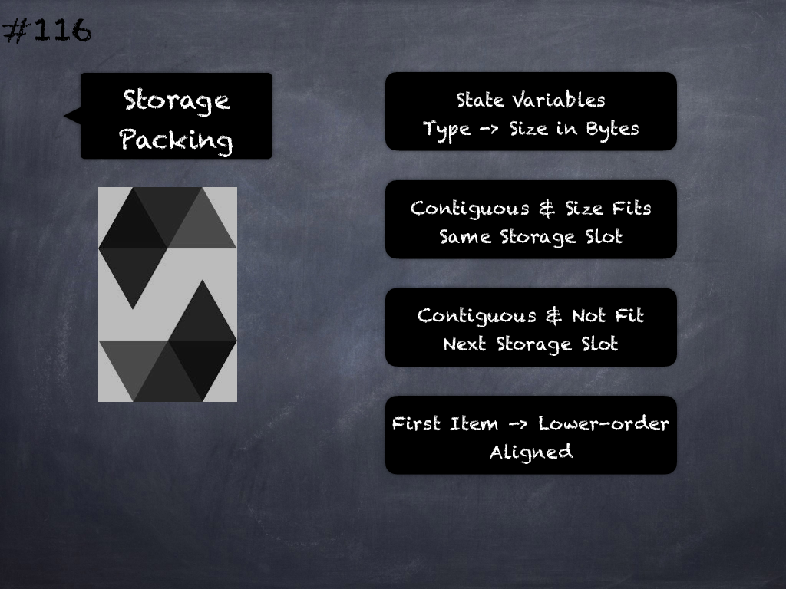

# 109 - [State Variables](State%20Variables.md)
Public state variables can override external functions if the parameter and return types of the function matches the getter function of the variable. 

While public state variables can override external functions, they themselves cannot be overridden.

___
## Slide Screenshot

___
## Slide Deck
- Public State Variables
- Automatic Getters
- externals Functions -> Parameters & Return Types
- Getters -> Override external Functions
- Override X -> Getters
___
## References
- [Youtube Reference](https://youtu.be/3bFgsmsQXrE?t=687)
___
## Tags