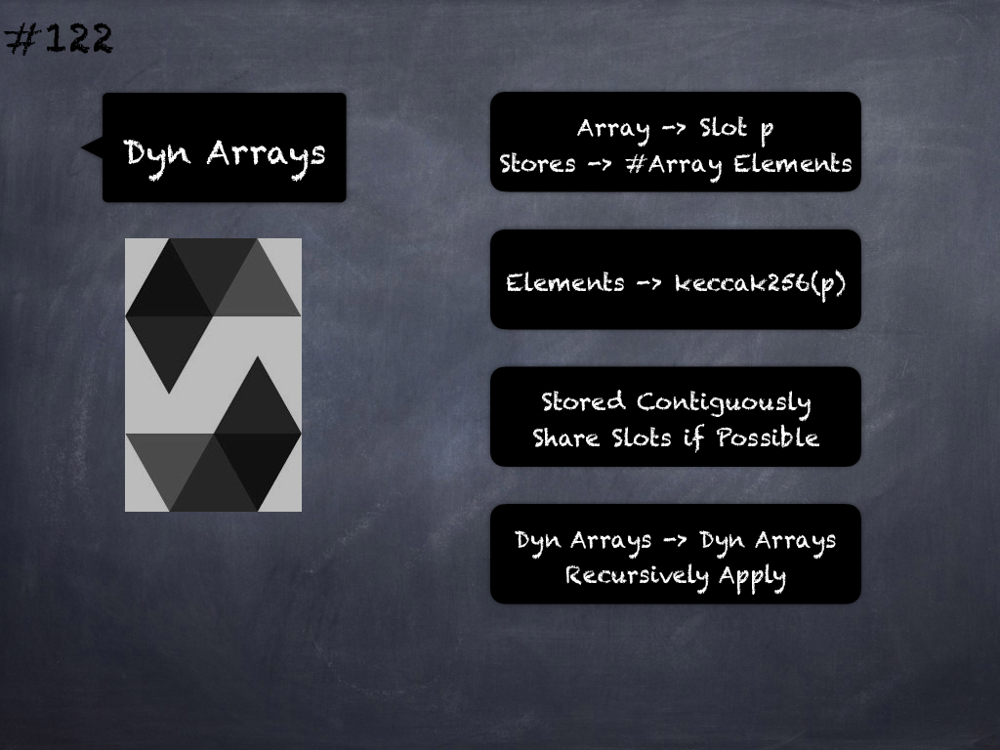

# 116 - [Storage Packing](Storage%20Packing.md)
Storage Layout Packing: For each [state variable](State%20Variables.md), a size in bytes is determined according to its type. 

Multiple, contiguous items that need less than 32 bytes are packed into a single storage slot if possible, according to the following rules:

1. The first item in a storage slot is stored lower-order aligned
    
2. Value types use only as many bytes as are necessary to store them
    
3. If a value type does not fit the remaining part of a storage slot, it is stored in the next storage slot

___
## Slide Screenshot

___
## Slide Text
- [State Variables](State%20Variables.md)
- Type -> Size in Bytes
- Contiguous & Size Fits
	- Same Storage Slot
- Contiguous & Not Fit
	- Next Storage Slot
- First Item -> Lower-order Aligned
___
## References
- [Youtube Reference](https://youtu.be/3bFgsmsQXrE?t=1162)
___
## Tags
[Storage](../Ethereum101/Storage.md), [Stack Memory, Storage, and Flow Operations](../Ethereum101/Stack%20Memory,%20Storage,%20and%20Flow%20Operations.md), [Storage Layout](Storage%20Layout.md), [Storage Packing](Storage%20Packing.md), [Storage Layout & Ordering](Storage%20Layout%20&%20Ordering.md), [[Storage Layout & Inheritance](Storage%20Layout%20&%20Inheritance.md)], [Storage Layout for Mappings & Dynamic Arrays](Storage%20Layout%20for%20Mappings%20&%20Dynamic%20Arrays.md), [State Variables](../Solidity101/State%20Variables.md), [State Variables](State%20Variables.md)