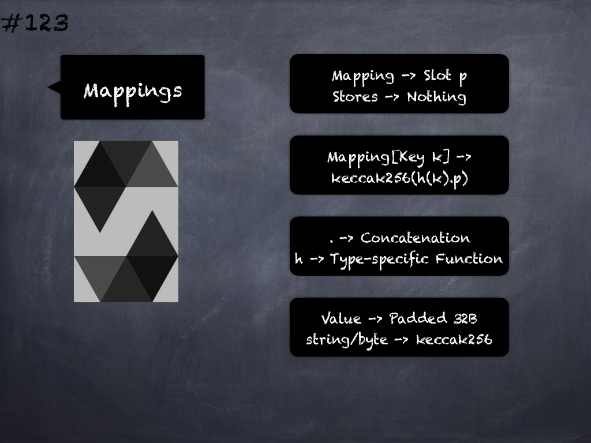

# 117 - [Structs & Arrays](Structs%20&%20Arrays.md)
Storage Layout & Structs/Arrays: 
    
1. Structs and array data always start a new slot and their items are packed tightly according to these rules

2. Items following struct or array data always start a new storage slot

1. The elements of structs and arrays are stored after each other, just as if they were given as individual values.

___
## Slide Screenshot

___
## Slide Deck
- Structs & Arrays Storage Rules
- Structs & Arrays -> Start New Storage Slot
- Following Items -> Start New Storage Slot
- Elements -> Contiguous Individual Values
___
## References
- [Youtube Reference](https://youtu.be/3bFgsmsQXrE?t=1259)
___
## Tags