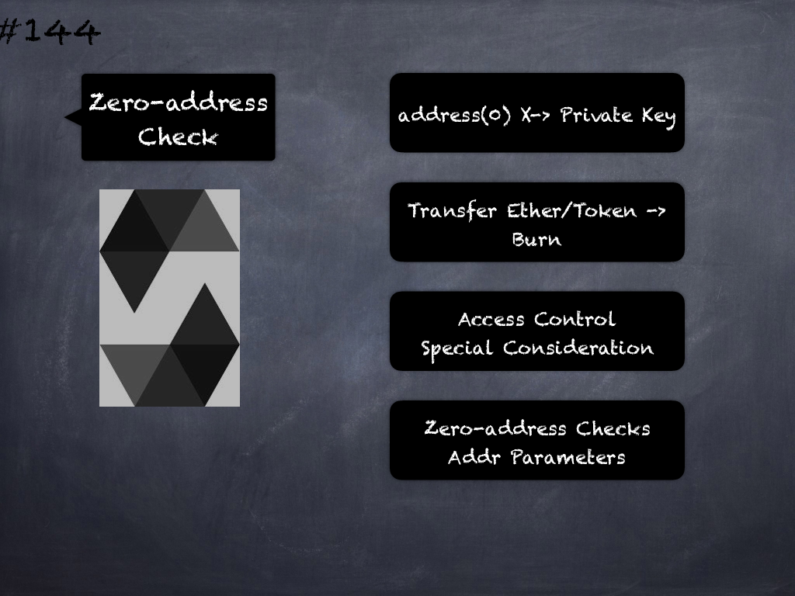

# 144 - [Zero-address Check](Zero-address%20Check.md)
`address(0)` which is 20-bytes of 0’s is treated specially in Solidity contracts because the private key corresponding to this address is unknown. 

Ether and tokens sent to this address cannot be retrieved and setting access control roles to this address also won’t work (no private key to sign transactions). 

Therefore zero addresses should be used with care and checks should be implemented for user-supplied address parameters.

___
## Slide Screenshot

___
## Slide Deck
- address(0) X -> Private Key
- Transfer Ether/Token -> Burn
- Access Control
- Special Consideration
- Zero-Address Checks
- Addr Parameters
___
## References
- [Youtube Reference](https://youtu.be/C0zBhTgppLQ?t=492)
___
## Tags