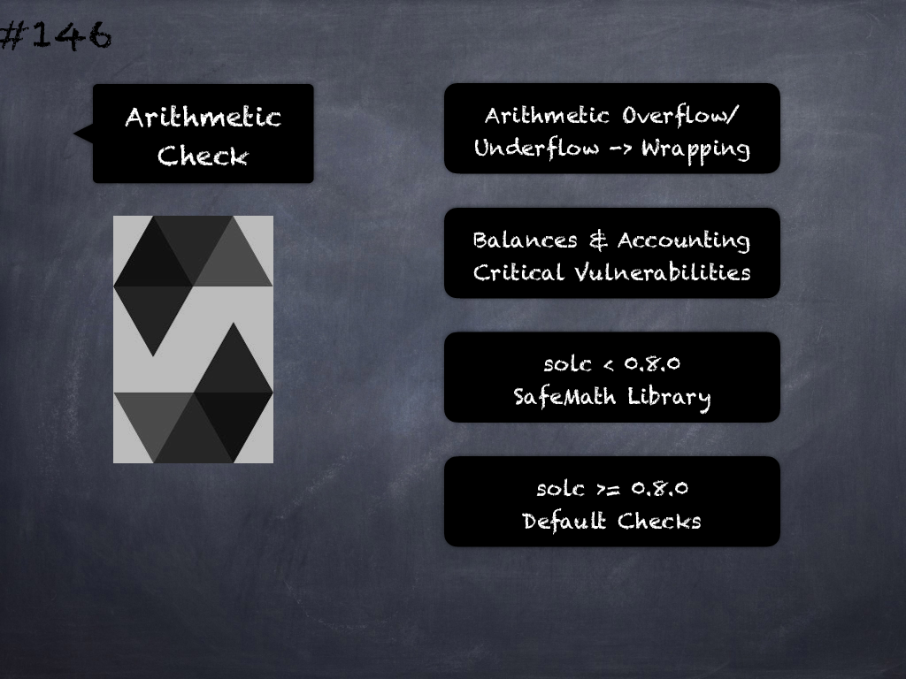

# 142 - [solc 0.8.0 Breaking](solc%200.8.0%20Breaking.md)
Solidity v0.8.0 Breaking Semantic Changes - changes where existing code changes its behaviour without the compiler notifying you about it:

1.  Arithmetic operations revert on underflow and overflow. You can use unchecked { ... } to use the previous wrapping behaviour. Checks for overflow are very common, so they are the default to increase readability of code, even if it comes at a slight increase of gas costs.
    
2.  ABI coder v2 is activated by default. You can choose to use the old behaviour using _pragma abicoder v1;_. The pragma _pragma experimental ABIEncoderV2;_ is still valid, but it is deprecated and has no effect. If you want to be explicit, please use _pragma abicoder v2;_ instead.
    
3.  Exponentiation is right associative, i.e., the expression _a**b**c_ is parsed as _a**(b**c)_. Before 0.8.0, it was parsed as _(a**b)**c_. This is the common way to parse the exponentiation operator.
    
4.  Failing assertions and other internal checks like division by zero or arithmetic overflow do not use the invalid opcode but instead the revert opcode. More specifically, they will use error data equal to a function call to Panic(uint256) with an error code specific to the circumstances. This will save gas on errors while it still allows static analysis tools to distinguish these situations from a revert on invalid input, like a failing require.
    
5.  If a byte array in storage is accessed whose length is encoded incorrectly, a panic is caused. A contract cannot get into this situation unless inline assembly is used to modify the raw representation of storage byte arrays.
    
6.  If constants are used in array length expressions, previous versions of Solidity would use arbitrary precision in all branches of the evaluation tree. Now, if constant variables are used as intermediate expressions, their values will be properly rounded in the same way as when they are used in run-time expressions.
    
7.  The type byte has been removed. It was an alias of bytes1.

___
## Slide Screenshot

___
## Slide Deck
- Checked Arithmetic
	- `unchecked {...}`
- Default ABI coder v2
- `a**(b**c)` Vs. `(a**b)**c`
- Revert Vs. Invalid Opcodes
- Storage byte Arrays
- Type byte Removed
___
## References
- [Youtube Reference](https://youtu.be/C0zBhTgppLQ?t=137)
___
## Tags