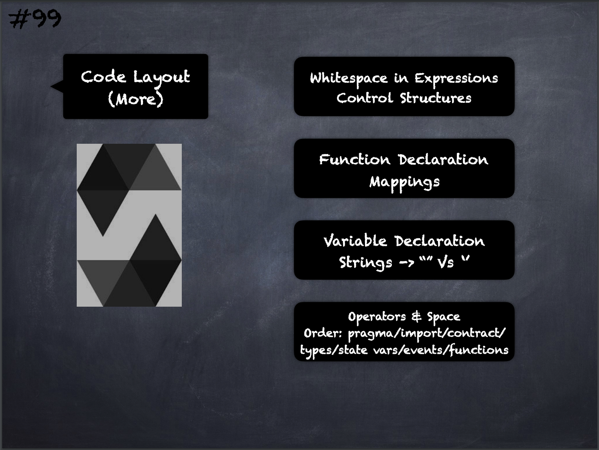

# 99 - [Code Layout Continued](Code%20Layout%20Continued.md)
1. Whitespace in Expressions: Avoid extraneous whitespace in the following situations —  Immediately inside parenthesis, brackets or braces, with the exception of single line function declarations.
    
2. Control Structures:  The braces denoting the body of a contract, library, functions and structs should: open on the same line as the declaration, close on their own line at the same indentation level as the beginning of the declaration. The opening brace should be preceded by a single space.
    
3. Function Declaration: For short function declarations, it is recommended for the opening brace of the function body to be kept on the same line as the function declaration. The closing brace should be at the same indentation level as the function declaration. The opening brace should be preceded by a single space.
    
4. Mappings: In variable declarations, do not separate the keyword mapping from its type by a space. Do not separate any nested mapping keyword from its type by whitespace.
    
5. Variable Declarations: Declarations of array variables should not have a space between the type and the brackets.
    
6. Strings should be quoted with double-quotes instead of single-quotes.
    
7. Operators: Surround operators with a single space on either side. Operators with a higher priority than others can exclude surrounding whitespace in order to denote precedence.This is meant to allow for improved readability for complex statements. You should always use the same amount of whitespace on either side of an operator
    
8. Layout contract elements in the following order: 
	1. [Pragma](Pragma.md) statements 
	2. [Import](Imports.md) statements 
	3. Interfaces
	4. Libraries
	5. [Contract](Contract.md) 
9. Inside each contract, library or interface, use the following order: 
	1. Type declarations
	2. [State variables](State%20Variables.md)
	3. [Events](Events.md)
	4. [Functions](Functions.md)

___
## Slide Screenshot

___
## Slide Deck
- Whitespace in Expressions
- Control Structures
- Function Declarations
- Mappings
- Variable Declaration
- Strings -> `""` vs `''`
- Operators & Space
- Order: pragma/import/contract/types/state vars/event/functions
___
## References
- [Youtube Reference](https://youtu.be/_oN7XuyhoZA?t=1594)

