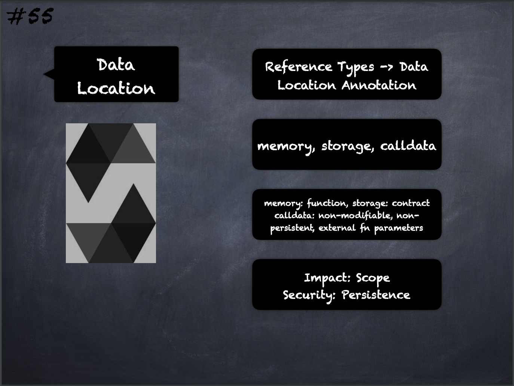

# 55 - [Data Location](Data%20Location.md)
Reference Types & Data Location: Every reference type has an additional annotation — the data location where it is stored. There are three data locations: `memory`, `storage` and `calldata`. 

1. `memory`: whose lifetime is limited to an external function call
    
2. `storage`: whose lifetime is limited to the lifetime of a contract and the location where the state variables are stored
    
3. `calldata`: which is a non-modifiable, non-persistent area where function arguments are stored and behaves mostly like memory. It is required for parameters of external functions but can also be used for other variables.
___
## Slide Screenshot

___
## Slide Deck
- Reference Types -> Data Location Annotation
- `memory`, `storage`, `calldata`
	- `memory`: function
	- `storage`: contract
	- `calldata`: non-modifiable, non-persistent, external fn parameters
- Impact -> Scope
- Security: Persistence
___
## References
- [Youtube Reference](https://youtu.be/6VIJpze1jbU?t=1738)
___
## Tags
[Calldata](../1.%20Ethereum101/Calldata.md), [Memory](../1.%20Ethereum101/Memory.md), [Storage](../1.%20Ethereum101/Storage.md)