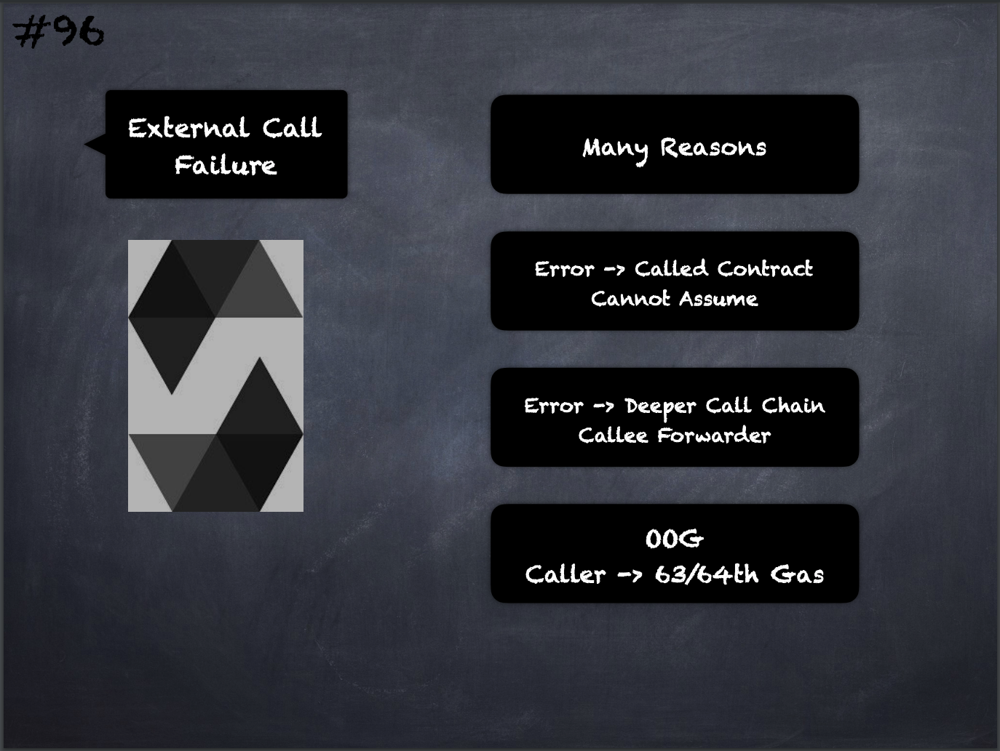

# 96 - [External Call Failure](External%20Call%20Failure.md)
The reason behind a failed call can be manifold. 

Do not assume that the error message is coming directly from the called contract: 

- The error might have happened deeper down in the call chain and the called contract just forwarded it. 

Also, it could be due to an out-of-gas situation and not a deliberate error condition: 

- The caller always retains 63/64th of the gas in a call and thus even if the called contract goes out of gas, the caller still has some gas left

___
## Slide Screenshot

___
## Slide Deck
- Many Reasons
- Error -> Called Contract Cannot Assume
- Error -> Deeper Call Chain Callee Forwarder
- `OOG` (Out Of Gas)
- Caller -> 63/64th Gas
___
## References
- [Youtube Reference](https://youtu.be/_oN7XuyhoZA?t=1284)

