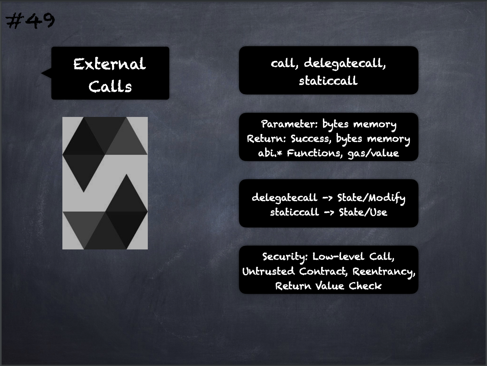

Call/Delegatecall/Staticcall: In order to interface with contracts that do not adhere to the [ABI](../1.%20Ethereum101/ABI.md), or to get more direct control over the encoding, the functions `call`, `delegatecall` and `staticcall` are provided. 

They all take a single `bytes` memory parameter and return the success condition (as a [bool](Boolean.md)) and the returned data `(bytes memory)`. 

The functions `abi.encode`, `abi.encodePacked`, `abi.encodeWithSelector` and `abi.encodeWithSignature` can be used to encode structured data.

1. `gas` and `value` modifiers can be used with these functions (`delegatecall` doesn’t support `value`) to specify the amount of gas and Ether value passed to the callee.
    
2. With `delegatecall`, only the code of the given address is used but all other aspects (storage, balance, `msg.sender` etc.) are taken from the current contract. The purpose of `delegatecall` is to use library/logic code which is stored in callee contract but operate on the state of the caller contract
    
3. With `staticcall`, the execution will revert if the called function modifies the state in any way

___
## Slide Screenshot

___
## Slide Deck
- call, delegatecall, staticcall
- Parameters: `bytes memory`
- Return: `success, bytes memory`
- `abi.\*` -> Functions, gas/value
- `delegatecall` -> State/Modify
- `staticcall` -> State/Use
- Security: Low-level Call, Untrusted Contract, Reentrancy, Return Value Check
___
## References
- [Youtube Reference](https://youtu.be/6VIJpze1jbU?t=1173)
___
## Tags
[System Operations](../1.%20Ethereum101/System%20Operations.md)
[ABI Encoding-Decoding](ABI%20Encoding-Decoding.md)

