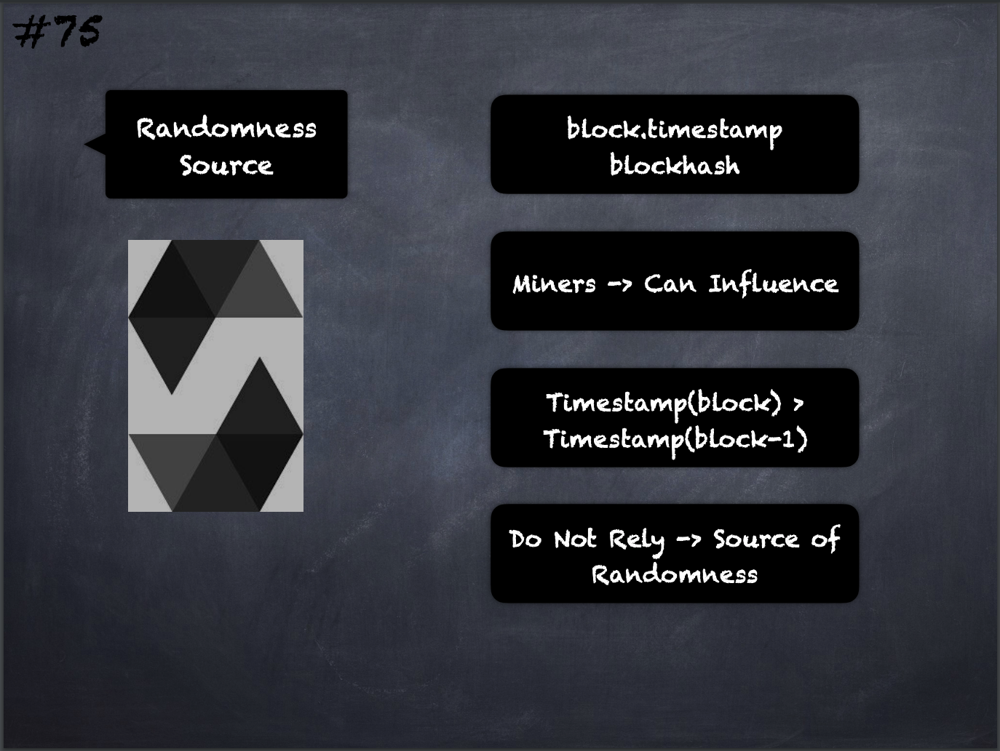

# 75 - [Randomness Source](Randomness%20Source.md)
Do not rely on `block.timestamp` or `blockhash` as a source of randomness. 

Both the `timestamp` and the `blockhash` can be influenced by miners to some degree. 

The current block timestamp must be strictly larger than the timestamp of the last block, but the only guarantee is that it will be somewhere between the timestamps of two consecutive blocks in the canonical chain.

___
## Slide Screenshot

___
## Slide Deck
- block.timestamp
- blockhash
- Miners -> Can Influence
- `Timestamp(block) > Timestamp(block-1)`
- Do Not Rely -> Source of Randomness
___
## References
- [Youtube Reference](https://youtu.be/WgU7KKKomMk?t=1289)

