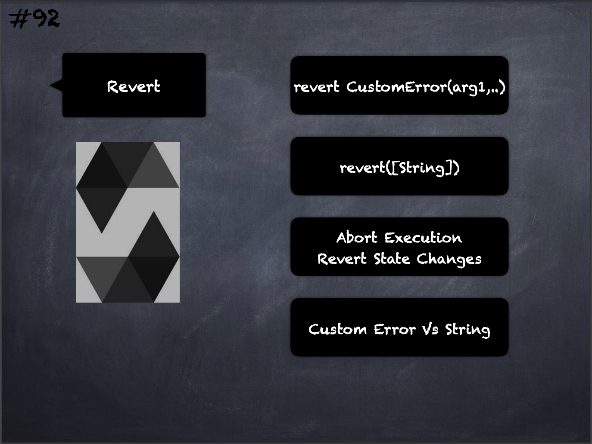

# 92 - [Revert](Revert.md)
A direct revert can be triggered using the revert statement and the revert function. 

The revert statement takes a custom error as a direct argument without parentheses: revert `CustomError(arg1, arg2)`. 

The `revert()` function is another way to trigger exceptions from within other code blocks to flag an error and revert the current call. 

The function takes an optional string message containing details about the error that is passed back to the caller and it will create an Error(string) exception.

Using a custom error instance will usually be much cheaper than a string description, because you can use the name of the error to describe it, which is encoded in only four bytes.

A longer description can be supplied via [NatSpec](NatSpec.md) which does not incur any costs.
___
## Slide Screenshot

___
## Slide Deck
- `revert CustomErrors(arg1,..)`
- `revert([String])`
- Abort Execution
- Revert State Changes
- Custom `Error` Vs. `String`
___
## References
- [Youtube Reference](https://youtu.be/_oN7XuyhoZA?t=967)

