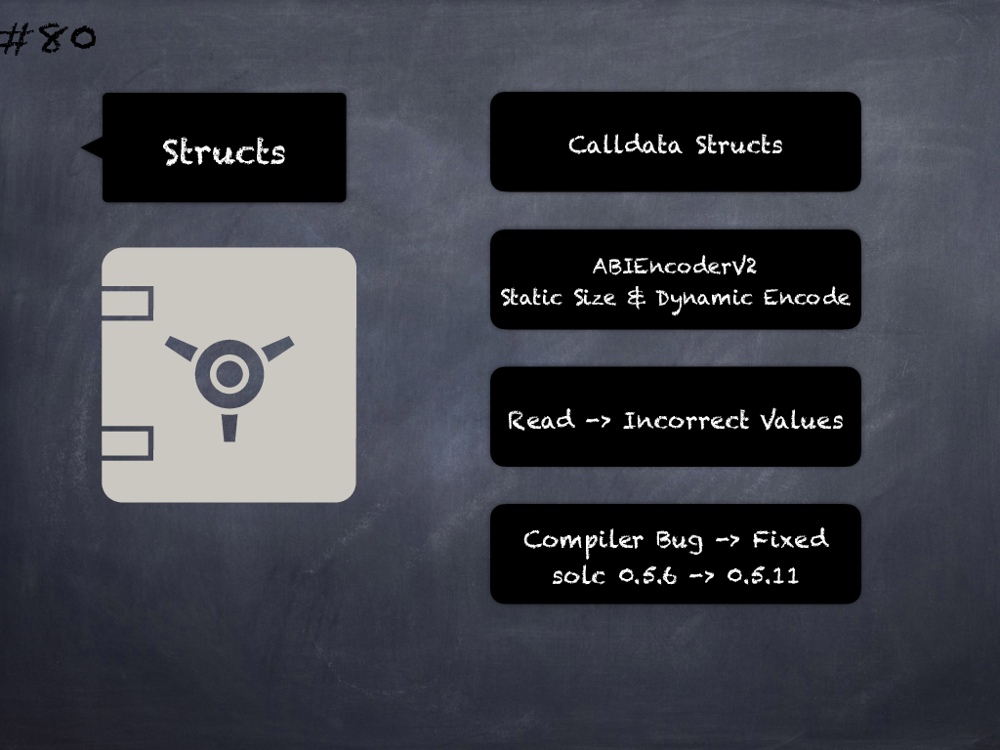

# 80 - [Calldata structs with statically sized and dynamically encoded members with ABIEncoderV2](Calldata%20structs%20with%20statically%20sized%20and%20dynamically%20encoded%20members%20with%20ABIEncoderV2.md)
Reading from calldata structs that contain dynamically encoded, but statically sized members can result in incorrect values. This is due to a compiler bug introduced in `v0.5.6` and fixed in `v0.5.11`. (see [here](https://docs.soliditylang.org/en/v0.8.9/bugs.html))

___
## Slide Screenshot

___
## Slide Text
- 
___
## References
- Youtube Reference
___
## Tags