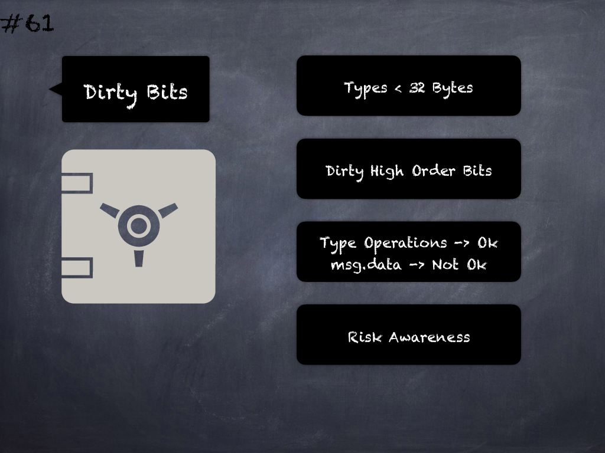

# 61 - [Malleability risk from dirty high order bits](Malleability%20risk%20from%20dirty%20high%20order%20bits.md)
Types that do not occupy the full 32 bytes might contain “dirty higher order bits” which does not affect operation on types but gives different results with `msg.data`. (see [here](https://docs.soliditylang.org/en/v0.8.1/security-considerations.html#minor-details))

___
## Slide Screenshot

___
## Slide Text
- 
___
## References
- Youtube Reference
___
## Tags