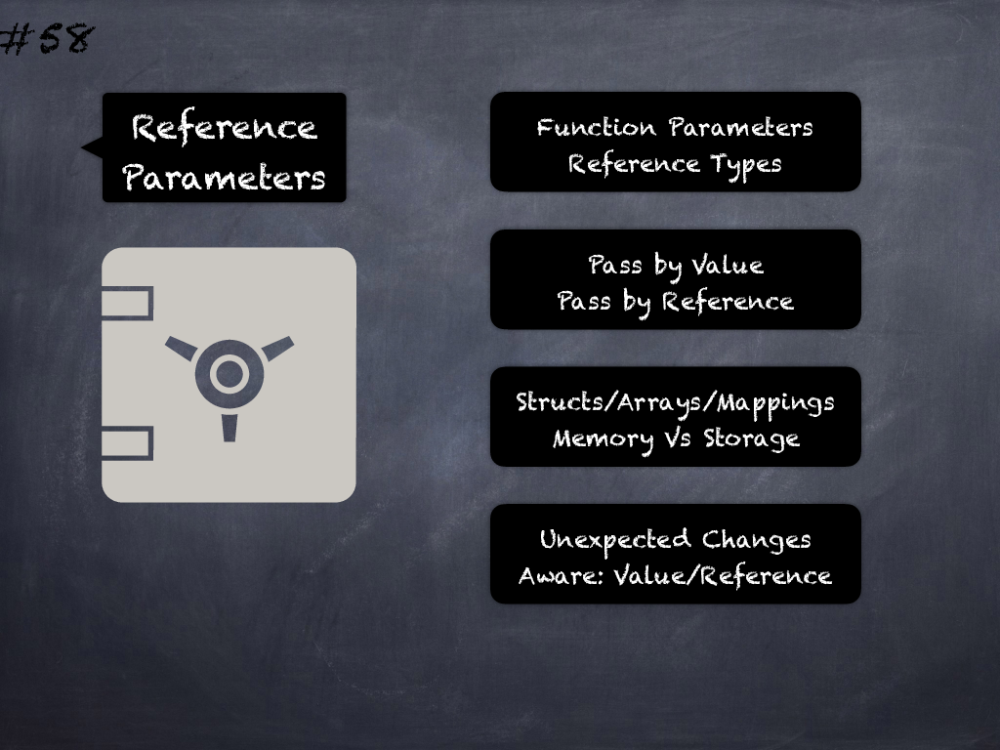

# 58 - [Modifying reference type parameters](Modifying%20reference%20type%20parameters.md)
Structs/Arrays/Mappings passed as arguments to a function may be by value (memory) or reference (storage) as specified by the data location (optional before `solc 0.5.0`). Ensure correct usage of memory and storage in function parameters and make all data locations explicit. (see [here](https://github.com/crytic/slither/wiki/Detector-Documentation#modifying-storage-array-by-value))
___
## Slide Screenshot

___
## Slide Text
- 
___
## References
- Youtube Reference
___
## Tags