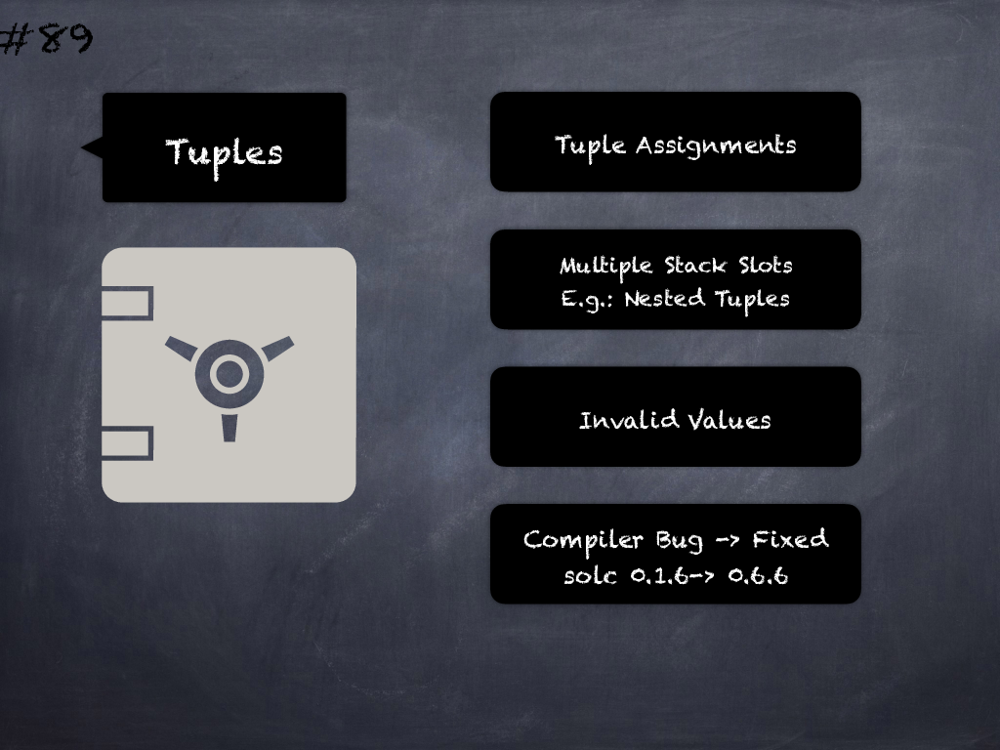

# 89 - [Tuple assignment multi stack slot components](Tuple%20assignment%20multi%20stack%20slot%20components.md)
Tuple assignments with components that occupy several stack slots, i.e. nested tuples, pointers to external functions or references to dynamically sized calldata arrays, can result in invalid values. This is due to a compiler bug introduced in `v0.1.6` and fixed in `v0.6.6`. (see [here](https://docs.soliditylang.org/en/v0.8.9/bugs.html))
___
## Slide Screenshot

___
## Slide Text
- 
___
## References
- Youtube Reference
___
## Tags