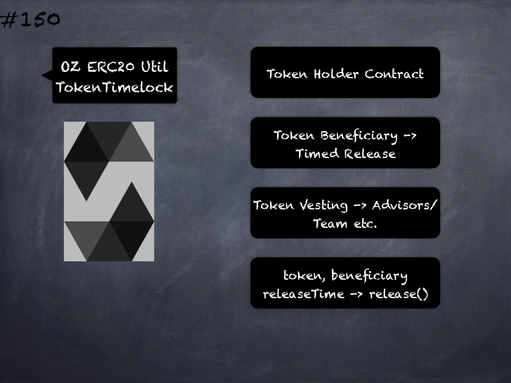

# 146 - [Arithemtic Check](Arithemtic%20Check.md)
Overflow/Underflow Check: Until Solidity version 0.8.0 which introduced checked arithmetic by default, arithmetic was unchecked and therefore susceptible to overflows and underflows which could lead to critical vulnerabilities. 

The recommended best-practice for such contracts is to use OpenZeppelin’s SafeMath library for arithmetic.

___
## Slide Screenshot

___
## Slide Text
- Arithmetic Overflow/Underflow -> Wrapping
- Balance & Accounting
- Critical Vulnerabilities
- solc `<` 0.8.0
	- SafeMath Library
- solc `>=` 0.8.0
	- Default Checks
___
## References
- [Youtube Reference](https://youtu.be/C0zBhTgppLQ?t=658)
___
## Tags