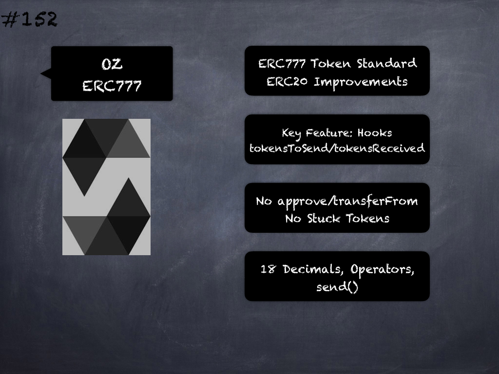

# 152 - [OZ ERC777](OZ%20ERC777.md)
OpenZeppelin ERC777: Like ERC20, ERC777 is a standard for fungible tokens with improvements such as getting rid of the confusion around decimals, minting and burning with proper events, among others, but its killer feature is receive hooks. ERC777 is backwards compatible with ERC20 (See [here](https://eips.ethereum.org/EIPS/eip-777))

1.  A hook is simply a function in a contract that is called when tokens are sent to it, meaning accounts and contracts can react to receiving tokens. This enables a lot of interesting use cases, including atomic purchases using tokens (no need to do approve and transferFrom in two separate transactions), rejecting reception of tokens (by reverting on the hook call), redirecting the received tokens to other addresses, among many others. 
    
2.  Both contracts and regular addresses can control and reject which token they send by registering a `tokensToSend` hook. (Rejection is done by reverting in the hook function.)
    
3.  Both contracts and regular addresses can control and reject which token they receive by registering a `tokensReceived` hook. (Rejection is done by reverting in the hook function.)
    
4.  The `tokensReceived` hook allows to send tokens to a contract and notify it in a single transaction, unlike ERC-20 which requires a double call (approve/transferFrom) to achieve this.
    
5.  Furthermore, since contracts are required to implement these hooks in order to receive tokens, no tokens can get stuck in a contract that is unaware of the ERC777 protocol, as has happened countless times when using ERC20s. 
    
6.  It mandates that decimals always returns a fixed value of 18, so there’s no need to set it ourselves
    
7.  Has a concept of  `defaultOperators` which are special accounts (usually other smart contracts) that will be able to transfer tokens on behalf of their holders
    
8.  Implements `send` (besides `transfer`) where if the recipient contract has not registered itself as aware of the ERC777 protocol then transfers to it are disabled to prevent tokens from being locked forever. Accounts can be notified of tokens being sent to them by having a contract implement this `IERC777Recipient` interface and registering it on the ERC1820 global registry.

___
## Slide Screenshot

___
## Slide Text
- ERC777 Token Standard
- ERC20 Improvements
- Key Feature: Hooks
- tokensToSend/tokensReceived
- No approve/transferFrom
- No Stuck Tokens
- 18 Decimals, Operators, send()
___
## References
- [Youtube Reference](https://youtu.be/C0zBhTgppLQ?t=1453)
- [Github: Open Zeppelin - ERC777.sol](https://github.com/OpenZeppelin/openzeppelin-contracts/blob/master/contracts/token/ERC777/ERC777.sol)
___
## Tags