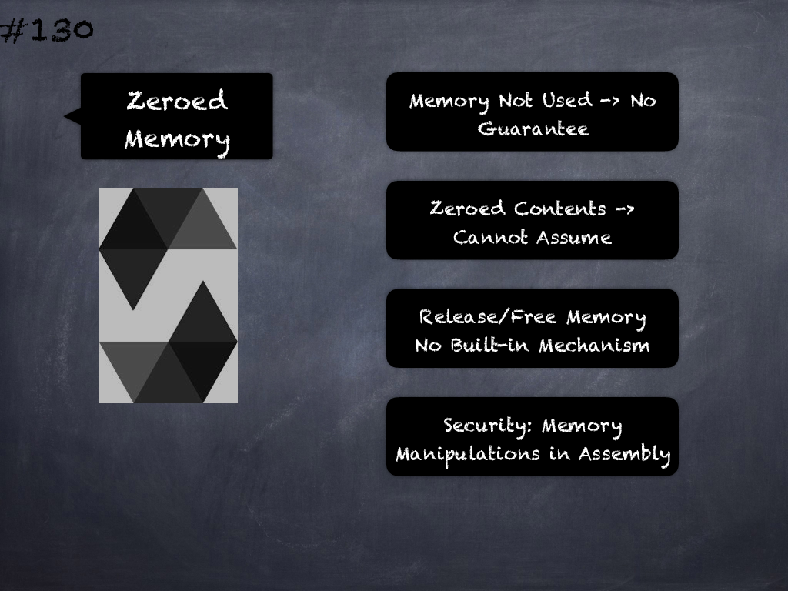

# 124 - [Storage Layout for bytes & string](Storage%20Layout%20for%20bytes%20&%20string.md)
[bytes and string](../2.%20Solidity%20101/bytes%20&%20string.md) are encoded identically. 

In general, the encoding is similar to `byte1[]`, in the sense that there is a slot for the array itself and a data area that is computed using a keccak256 hash of that slot’s position. 

However, for short values (shorter than 32 bytes) the array elements are stored together with the length in the same slot.

If the data is at most 31 bytes long, the elements are stored in the higher-order bytes (left aligned) and the lowest-order byte stores the value `length * 2`. 

For [bytes arrays](../2.%20Solidity%20101/Bytes%20Arrays.md) that store data which is 32 or more bytes long, the main `slot p` stores `length * 2 + 1` and the data is stored as usual in `keccak256(p)`. 

This means that you can distinguish a short array from a long array by checking if the lowest bit is set: short (not set) and long (set).

___
## Slide Screenshot

___
## Slide Text
- Storage Layout
	- Similar to [Arrays](../2.%20Solidity%20101/Arrays.md)
- Short Values
- Length + Elements -> Same Slot
- `<=` 31 Bytes -> Length \* 2
- `>=` 32 Bytes -> Length \* 2 + 1
- Lowest Bit -> 0 or 1
- Array Type -> Short or Long
___
## References
- [Youtube Reference](https://youtu.be/TqMIbouwePE?t=315)
___
## Tags
[Mapping Types](../2.%20Solidity%20101/Mapping%20Types.md), [bytes & string](../2.%20Solidity%20101/bytes%20&%20string.md),  [Storage](../1.%20Ethereum101/Storage.md), [Storage Layout](Storage%20Layout.md), [Storage Packing](Storage%20Packing.md), [Storage Layout & Types](Storage%20Layout%20&%20Types.md), [Storage Layout & Ordering](Storage%20Layout%20&%20Ordering.md), [Storage Layout for Mappings](Storage%20Layout%20for%20Mappings.md), [Storage Layout & Inheritance](Storage%20Layout%20&%20Inheritance.md), [Storage Layout for bytes & string](Storage%20Layout%20for%20bytes%20&%20string.md), [Storage Layout for Dynamic Arrays](Storage%20Layout%20for%20Dynamic%20Arrays.md), [Storage Layout for Mappings & Dynamic Arrays](Storage%20Layout%20for%20Mappings%20&%20Dynamic%20Arrays.md)