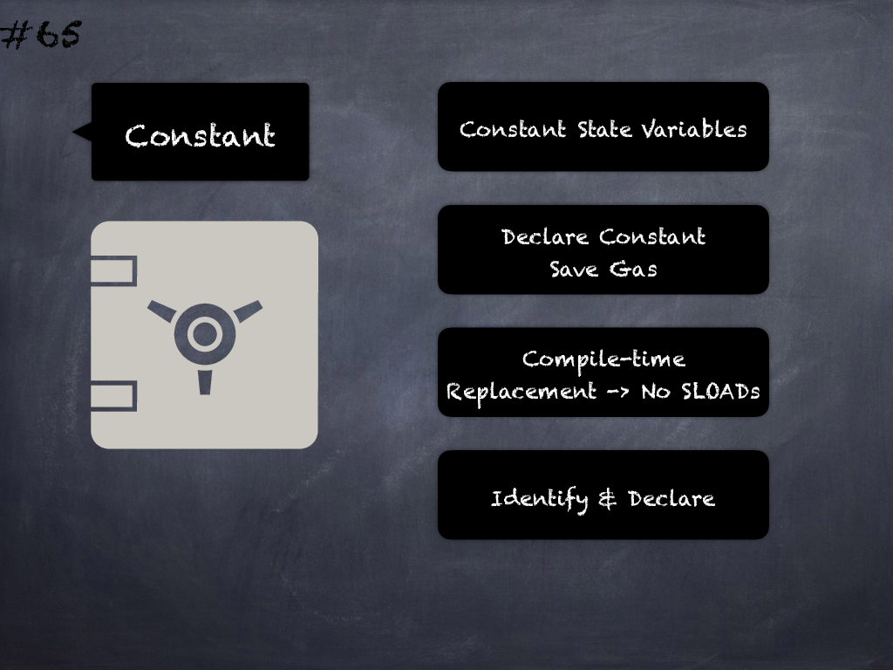

# 65 - [Constant state variables](Constant%20state%20variables.md)
Constant state variables should be declared constant to save gas. (see [here](https://github.com/crytic/slither/wiki/Detector-Documentation#state-variables-that-could-be-declared-constant))

___
## Slide Screenshot

___
## Slide Text
- Constant State Variables
- Declare Constant -> Save Gas
- Compile-time Replacement -> No SLOADs
- Identify & Declare
___
## References
- [Youtube Reference](https://youtu.be/byA3MLLiKMM?t=244)
___
## Tags