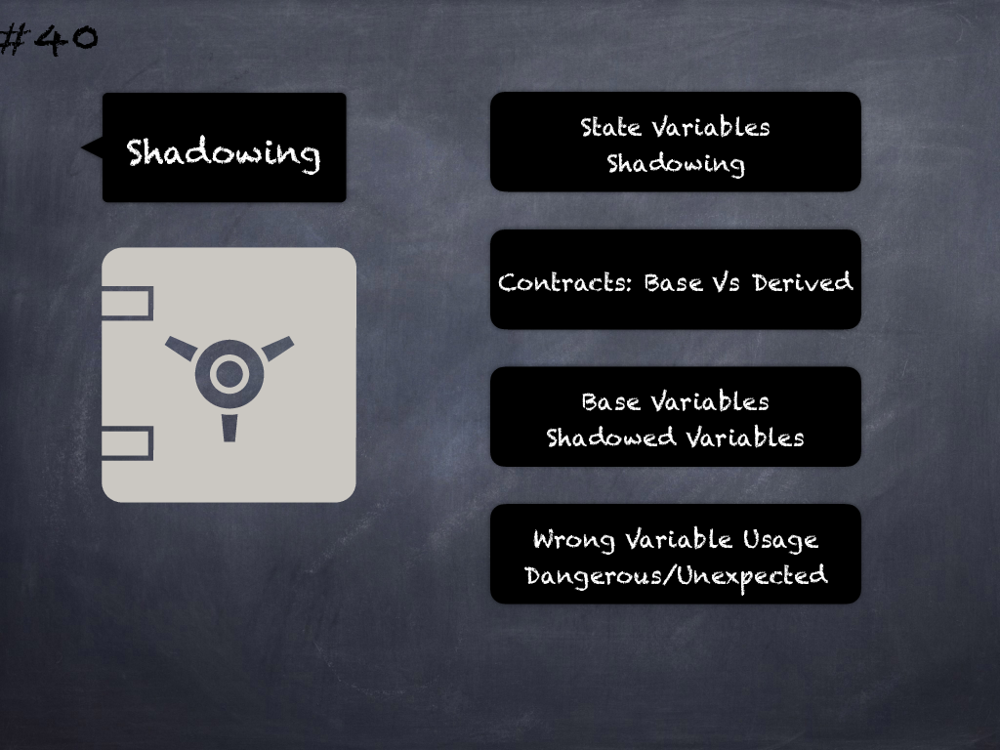

# 40 - [Dangerous state variable shadowing](Dangerous%20state%20variable%20shadowing.md)
Shadowing state variables in derived contracts may be dangerous for critical variables such as contract owner (for e.g. where modifiers in base contracts check on base variables but shadowed variables are set mistakenly) and contracts incorrectly use base/shadowed variables. Do not shadow state variables. (see [here](https://swcregistry.io/docs/SWC-119))
___
## Slide Screenshot

___
## Slide Text
- State Variables Shadowing
- Contracts: Base vs Derived
- Base Variables -> Shadowed Variables
- Wrong Variable Usage
- Dangerous/Unexpected
___
## References
- [Youtube Reference](https://youtu.be/fgXuHaZDenU?t=1477)
___
## Tags