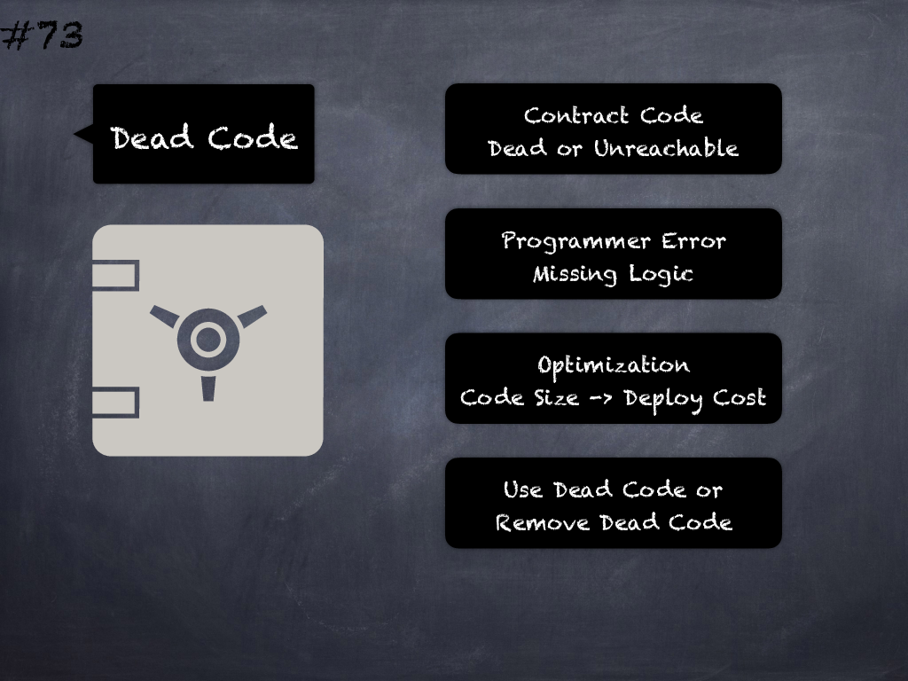

# 73 - [Dead, Unreachable code](Dead,%20Unreachable%20code.md)
Dead code may be indicative of programmer error, missing logic or potential optimization opportunity, which needs to be flagged for removal or addressed appropriately. (see [here](https://en.wikipedia.org/wiki/Dead_code))

___
## Slide Screenshot

___
## Slide Text
- 
___
## References
- Youtube Reference
___
## Tags