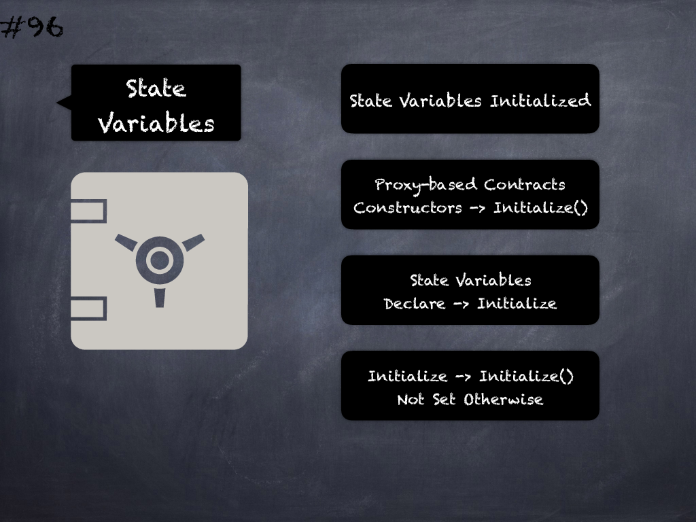

# 96 - [Initializing state-variables in proxy-based upgradeable contracts](Initializing%20state-variables%20in%20proxy-based%20upgradeable%20contracts.md)
This should be done in initializer functions and not as part of the state variable declarations in which case they won’t be set. (see [here](https://docs.openzeppelin.com/upgrades-plugins/1.x/writing-upgradeable#avoid-initial-values-in-field-declarations))

___
## Slide Screenshot

___
## Slide Text
- 
___
## References
- Youtube Reference
___
## Tags