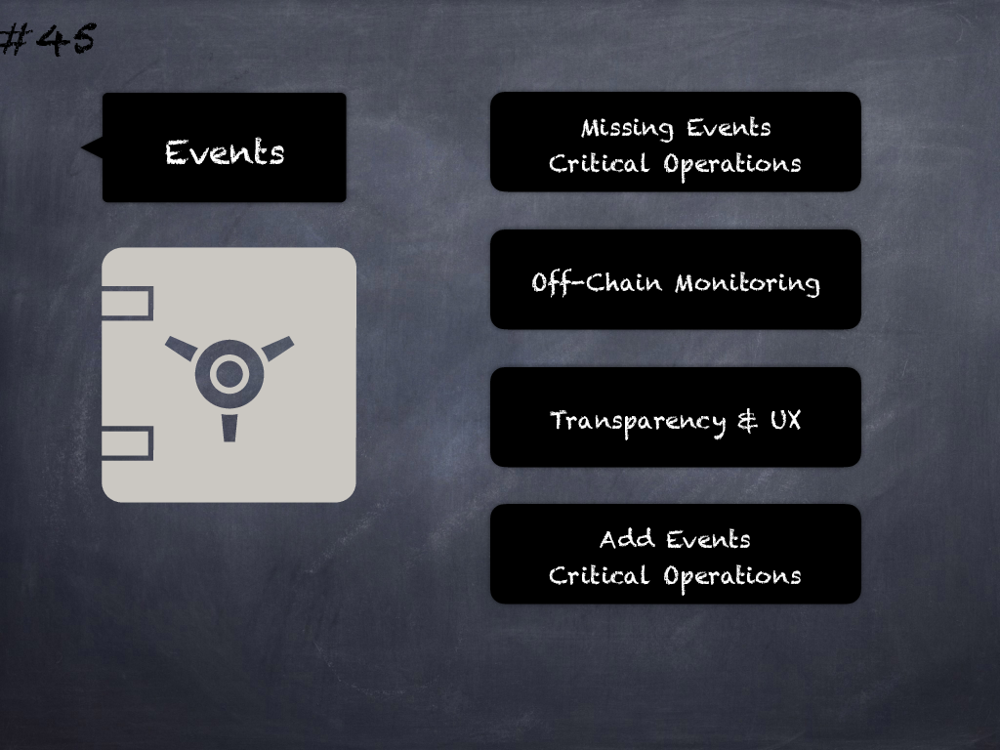

# 45 - [Missing events](Missing%20events.md)
Events for critical state changes (e.g. owner and other critical parameters) should be emitted for tracking this off-chain. (see [here](https://github.com/crytic/slither/wiki/Detector-Documentation#missing-events-access-control))

___
## Slide Screenshot

___
## Slide Text
- Missing Events
- Critical Operations
- Off-Chain Monitoring
- Transparency & UX
- Add Events -> Critical Operations
___
## References
- [Youtube Reference](https://youtu.be/YVewx1xVROE?t=343)
___
## Tags