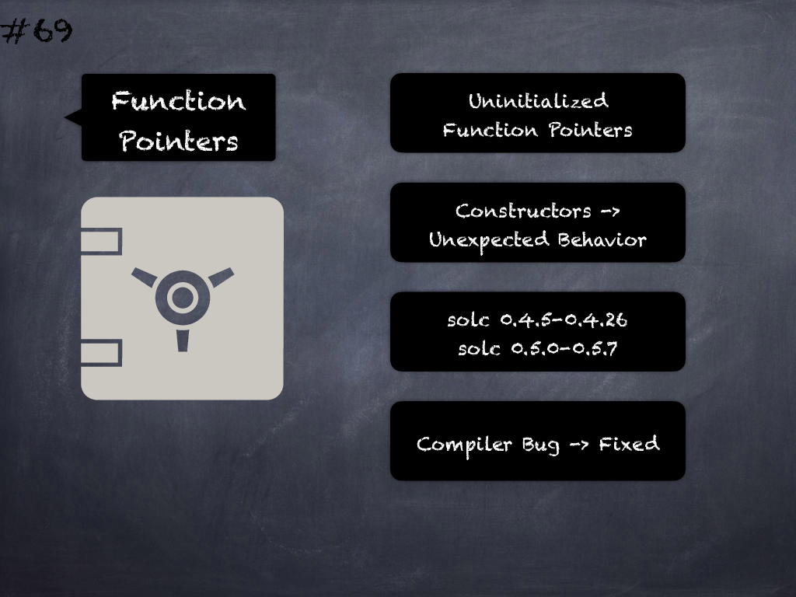

# 69 - [Uninitialized function pointers in constructors](Uninitialized%20function%20pointers%20in%20constructors.md)

Calling uninitialized function pointers in constructors of contracts compiled with `solc` versions `0.4.5-0.4.25` and `0.5.0-0.5.7` lead to unexpected behavior because of a compiler bug. (see [here](https://github.com/crytic/slither/wiki/Detector-Documentation#uninitialized-function-pointers-in-constructors))
___
## Slide Screenshot

___
## Slide Text
- 
___
## References
- Youtube Reference
___
## Tags