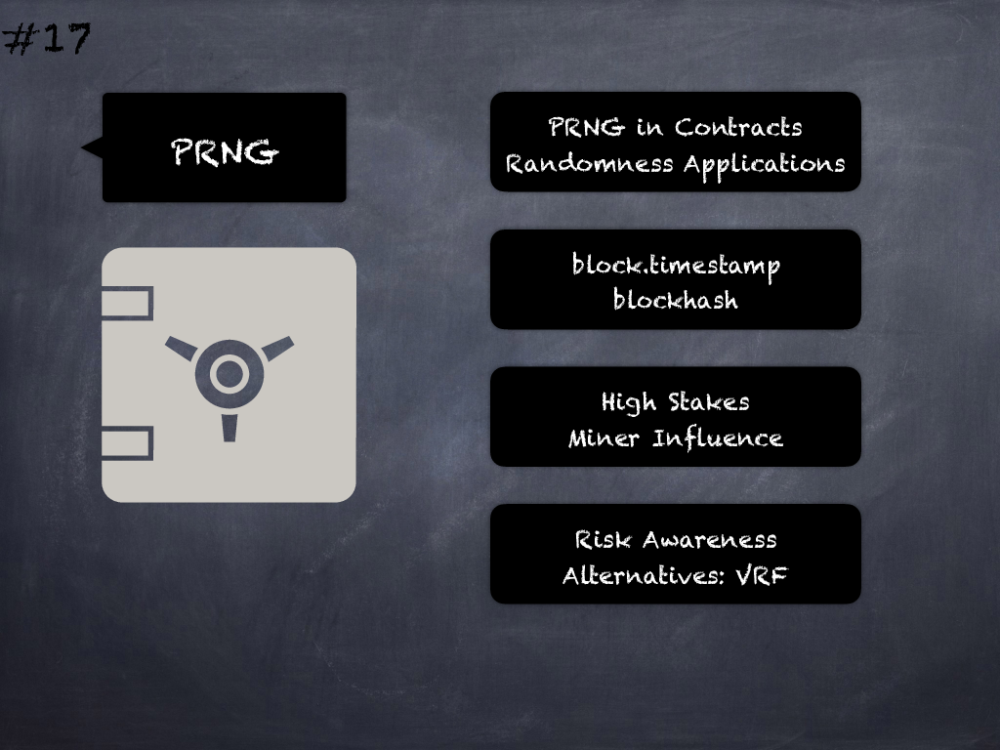

# 17 - [Weak PRNG](Weak%20PRNG.md)
PRNG relying on `block.timestamp`, `now` or `blockhash` can be influenced by miners to some extent and should be avoided. (see [here](https://swcregistry.io/docs/SWC-120))

___
## Slide Screenshot

___
## Slide Text
- PRNG in Contracts
- Randomness Applications
- block.timestamp
- blockhash
- High Stakes
- Miner Influence
- Risk Awareness
- Alternatives: VRF
___
## References
- [Youtube Reference](https://youtu.be/OOzyoaYIw2k?t=1546)
- [VRF - Chainlink](https://docs.chain.link/docs/chainlink-vrf/)
___
## Tags