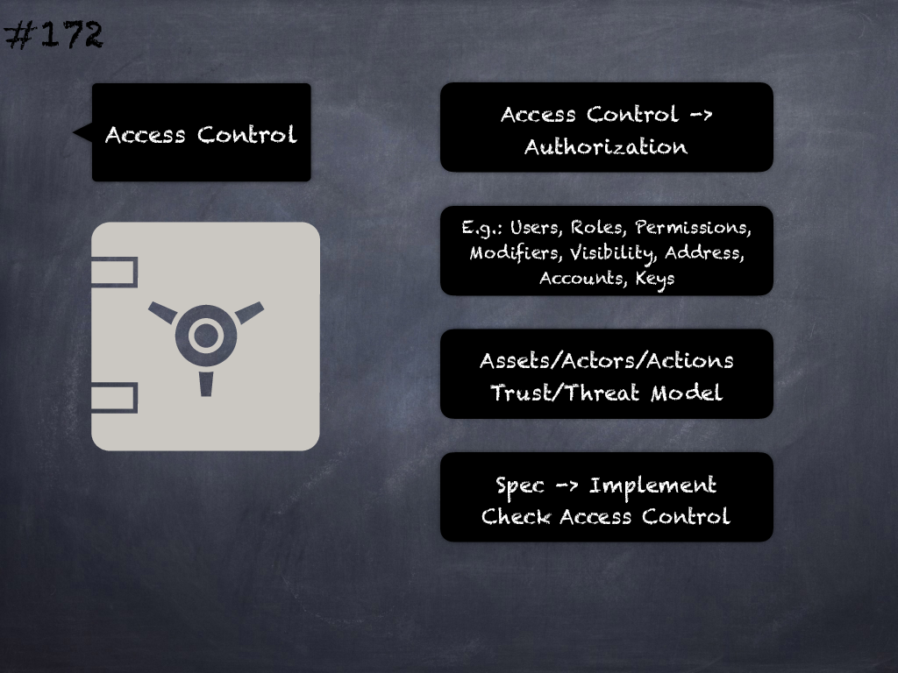

# 172 - [Access control issues](Access%20control%20issues.md)
Incorrect or insufficient access control or authorization related to system actors, roles, assets and permissions may lead to security issues.
___
## Slide Screenshot

___
## Slide Text
- 
___
## References
- Youtube Reference
___
## Tags