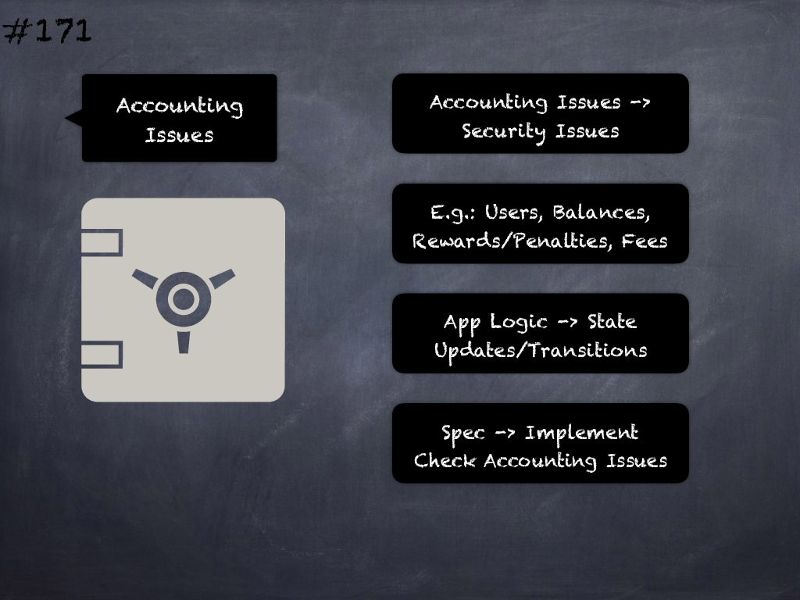

# 171 - [Accounting issues](Accounting%20issues.md)
Incorrect or insufficient tracking or accounting of business logic related aspects such as states, phases, permissions, roles, funds (deposits/withdrawals) and tokens (mints/burns/transfers) may lead to security issues.
___
## Slide Screenshot

___
## Slide Text
- 
___
## References
- Youtube Reference
___
## Tags