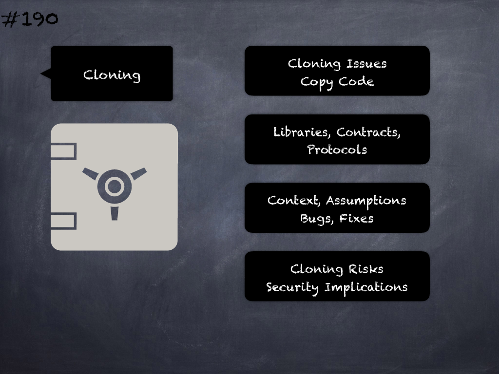

# 190 - [Cloning issues](Cloning%20issues.md)
Copy-pasting code from other libraries, contracts or even different parts of the same contract may result in incorrect code semantics for the context being copied to, copy over any vulnerabilities or miss any security fixes applied to the original code. All these may lead to security issues.
___
## Slide Screenshot

___
## Slide Text
- 
___
## References
- Youtube Reference
___
## Tags