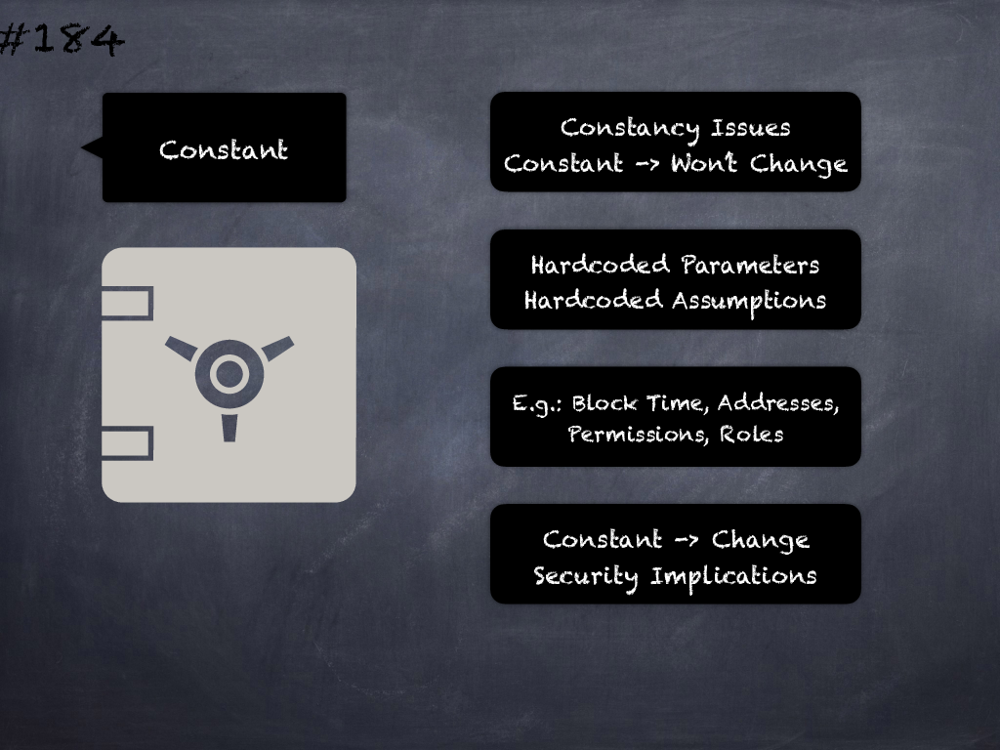

# 184 - [Constant issues](Constant%20issues.md)
Incorrect assumptions about system actors, entities or parameters being constant may lead to security issues if/when such factors change unexpectedly.
___
## Slide Screenshot

___
## Slide Text
- 
___
## References
- Youtube Reference
___
## Tags