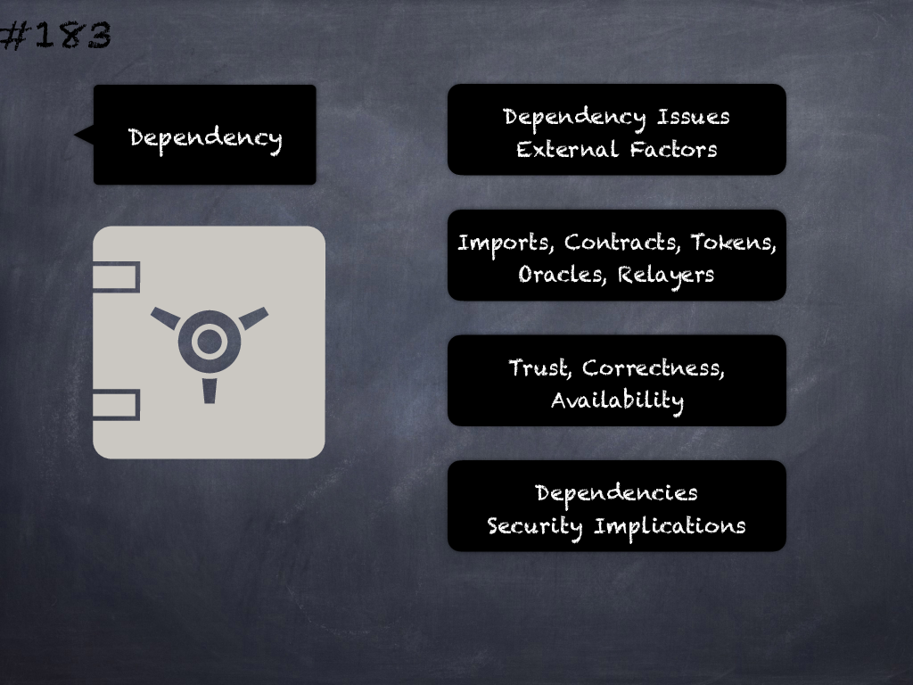

# 183 - [Dependency issues](Dependency%20issues.md)
Dependencies on external actors or software (imports, contracts, libraries, tokens etc.) will lead to trust/availability/correctness assumptions which if/when broken may lead to security issues.
___
## Slide Screenshot

___
## Slide Text
- 
___
## References
- Youtube Reference
___
## Tags