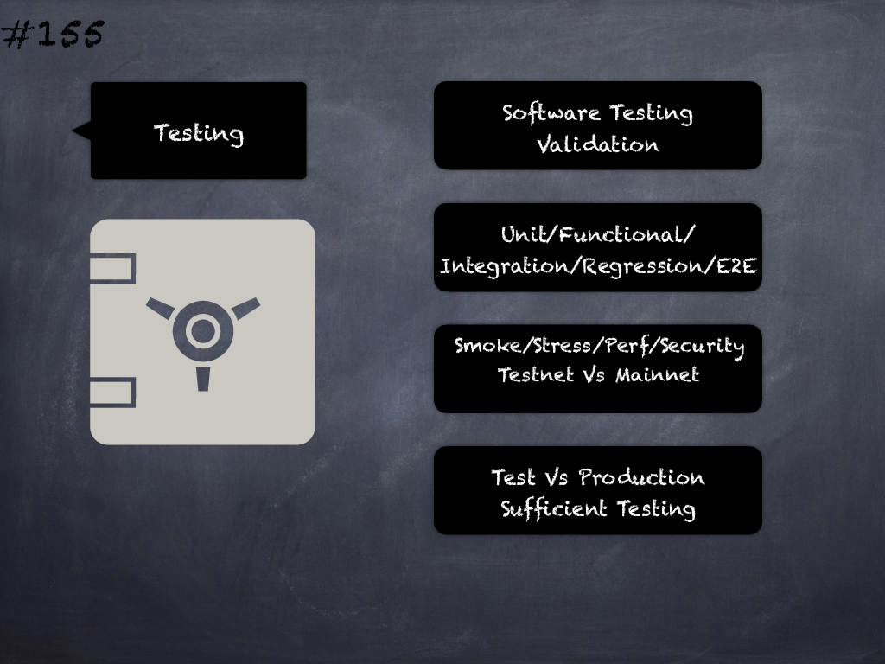

# 155 - [Tests](Tests.md)
Tests indicate that the system implementation has been validated against the specification. Unit tests, functional tests and integration tests should have been performed to achieve good test coverage across the entire codebase. Any code or parameterisation used specifically for testing should be removed from production code.
___
## Slide Screenshot

___
## Slide Text
- 
___
## References
- Youtube Reference
___
## Tags